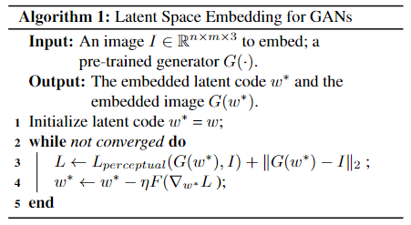
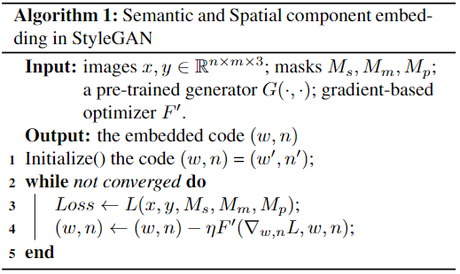
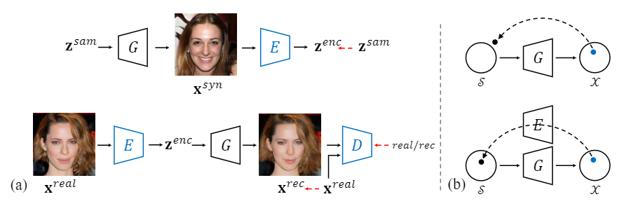
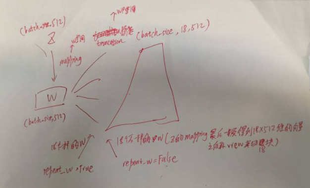
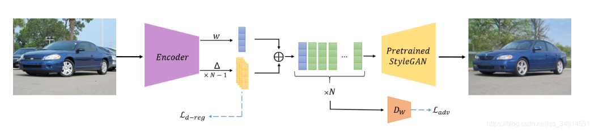
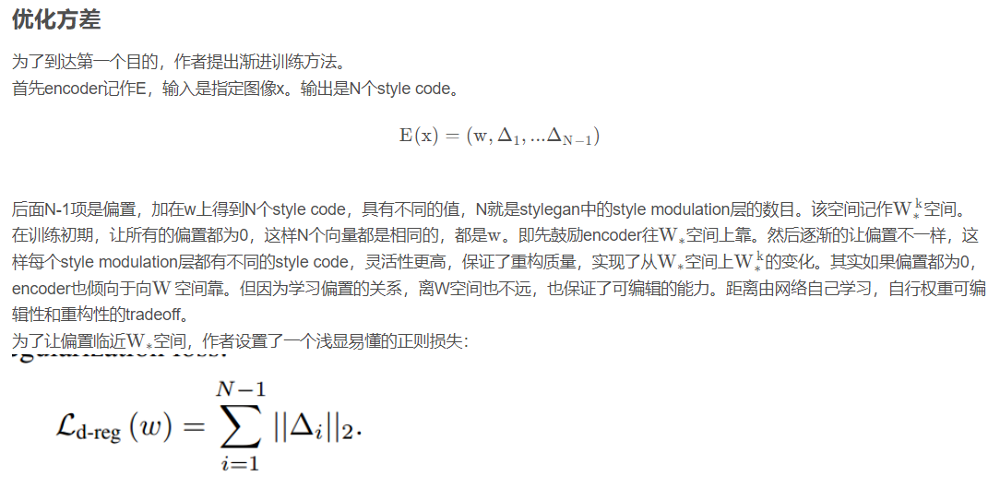
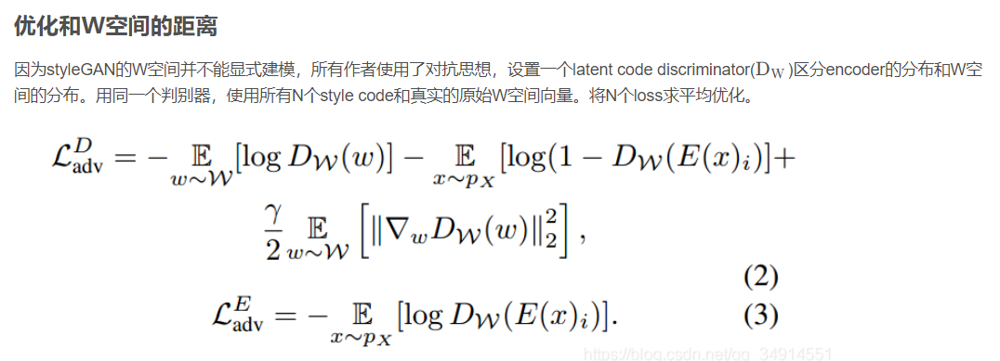
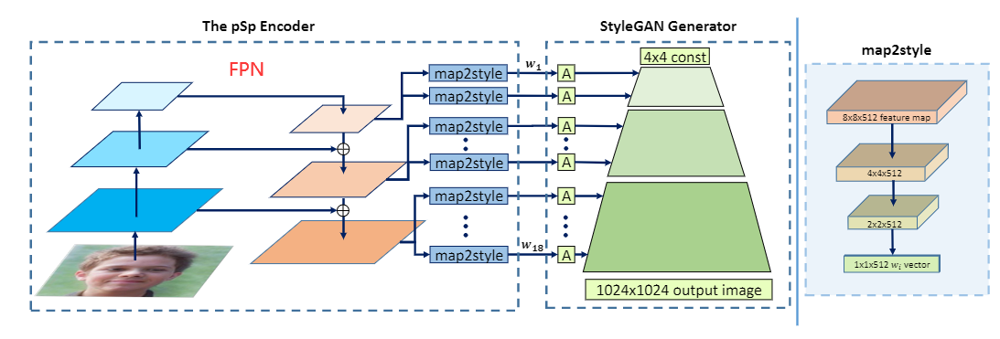
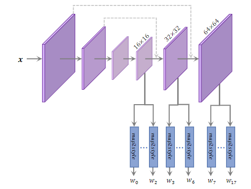
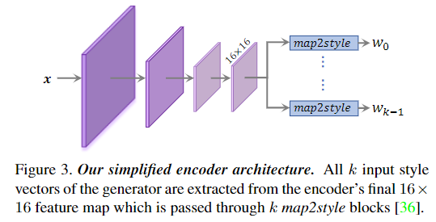

# 领域知识：

+ 一般有基于优化和基于学习的方式
+ 基于优化的方法迭代次数多，训练时间长，但是选择合适的空间，重建能力很强，不过因为不容易控制隐变量的分布，所以得到的z不适合编辑（脱离预训练生成器的隐空间）
+ 基于学习的方法速度快，但是重构能力低，需要设计很好的网络结构和损失，以及好的训练Encoer的方法

# Image2StyleGAN: How to Embed Images Into the StyleGAN Latent Space?

## Contribution

+ 提出一种基于优化的GAN反演方法
+ 提出一个新的W+隐空间
+ 对隐空间的特性进行研究

## Method

+ 

## Question

+ 基于优化的方法是不是也受限于生成器的预训练数据集？
  + image2style解释了，生成效果不太受限于stylegan生成器预训练的数据集，不过在人脸ffhq上训练后，在人脸类和其他类都有不错的反演效果，包括插值属性也不错，但在猫、卧室等数据集上训练的生成器，反演其他的类别图像效果就会弱很多，可能是因为人脸的分布与其他类别数据分布的重合导致。
+ 后续文章也证明，完全基于优化的方法，隐向量Z的可编辑性很不好，因为已经把Z优化出了GAN预训练的隐空间（富含语义信息）
  + 在人脸数据集上训练的StyleGAN，对人脸的插值还可以，对其他类别图像的插值识别不出来
  + 在其他类图像（车、猫、卧室）数据集上训练的StyleGAN，对其自身和其他类图像的线性插值效果都很差

# Image2StyleGAN++: How to Edit the Embedded Images?

## Contribution

+ 对前作进行一些改进
+ 算法允许缺失、局部近似嵌入等局部被修改的图像的反演
+ <u>embedding和activation tensor manipulation结合，提高全局语义编辑和局部编辑的效果</u>
+ 得到的隐向量对下游的图像编辑效果更好

## Method

+ 优化的隐向量不仅是W+空间中的w，同时还有一个噪声向量n
  + （w，n）共同重建图像，共同梯度优化，先优化w后n
  + 确保尽可能多的信息被编码在 w 中，并且仅在噪声空间中编码高频细节
+ 优化的时候使用三种spatial masks，提高算法的局部编辑能力
+ 

# In-Domain GAN Inversion for Real Image Editing

## Motivation

+ 直接对Z进行基于学习的反演，重建效果很差
+ 直接基于优化的方法，Z的可编辑性又差，因为没有重复利用与训练的GAN的隐空间的语义信息

## Contribution

+ 提出两部优化，domain-guided和domain-regularized
  + 前者学习一个Encoder
    + 对于重建图像并不是计算和真实图像的距离，而是通过判别器判别哪个是真实图像哪个是重建图像
  + 后者把Encoder当作一个正则项。在给定目标图像后，一是用来找到一个初始化Z，二是能够在优化Z的时候作为一个正则项，使优化的Z尽可能的在GAN的语义空间内。就是加入一个新的损失-每次生成的图片经过E得到一个Z去和原Z计算损失（文中称域内损失）。作者说可以把充分利用生成器的域的语义信息，通过E把Z限制到与训练的G的隐空间域，使Z带有更多的语义信息，但如此肯定会影响Z的一个图像重建效果。

## Model

+ 

## Code

+  W空间和W+空间，前者输到生成器每一层A的w都是一样的（类似正常StyleGAN训练时的输入），后者不一样（所以有18个不同的w，这18个不同的w就构成了W+空间）
+ 虽然图中，easy_synthesize获得W+空间得隐向量得时候，18个w相同，但如果在W+空间上进行反演，那么优化后就会有18个不同的w，相对应，如果是在W空间上进行反演，那么经过truncation后还是会得到18个相同的w输入到StyleGAN生成器每一层对应的A中

+ 其中输入到生成器中的隐向量均是未经过风格调制层A的，A属于训练好的生成器的范围内；因此无论是W还是W+空间，输入到生成器中的隐向量都会经过一个A，将隐向量变换成Style（对于每一个卷积层）
  + stylegan_generator_network.py
    + EpilogueBlock：每个卷积层后的操作，包括噪声、风格调制等
    + StyleModulationLayer：即风格调制层，其中包括所说的A（DenseBlock）
+ 

## Question

+ 推理时，给Encoder输入一个训练数据分布以外的图像，效果会很差。训练时如果使用的数据集和GAN生成器预训练的数据集不同，训练出来的Encoder可能也会很差。说明训练过程还是比较依赖GAN生成器预训练的那个数据集的分布。这很大程度上限制了许多Image-to-Image tasks。

# (e4e)Designing an Encoder for StyleGAN Image Manipulation

+ 重构图片的效果、可编辑性的强弱，分别用distortion和editability代表distortion低（表示重构图片效果较好）的一般editability能力弱。

## Contribution

+ 作者观察到W空间的重建能力弱，W+空间的可编辑能力弱，作者希望得到训练一个编码器，使图片能映射到隐空间上，同时设计损失保证可编辑的能力

## Model

+ 
+ 
+ 

# (pSp)Encoding in Style: a StyleGAN Encoder for Image-to-Image Translation

## Motivation

+ W+空间比W空间好，但是不容易训练Encoder直接将图片映射到其中，之前都是通过优化的方式找到W+空间的隐向量，这很耗时

## Contribution

+ 提出了一个直接把图片映射到W+空间的Encoder，而不是像Image2Style那样使用优化的方式去找W+空间中的z
+ 提出了一个通用的！端到端的！能解决很多图像领域任务（反演、转正、修复、条件生成、超分、插值）的！框架。

## Model

+ 

+ 
+ **map2style**：a set of 2-strided convolutions followed by LeakyReLU activations

# **ReStyle: A Residual-Based StyleGAN Encoder via Iterative Refinement**

## Model

+ 所提出架构中的Encoder可以是PSP或E4E，所以是一个通用架构
+ 
+ 作者通过Restyle方式减小了对Encoder的复杂度的要求，所以对PSP和E4E中使用的FPN结构进行简化，取得了近似的结果
+ 
