# 领域知识：

+ 一般有基于优化和基于学习的方式
+ 基于优化的方法迭代次数多，训练时间长，但是选择合适的空间，重建能力很强，不过因为不容易控制隐变量的分布，所以得到的z不适合编辑（脱离预训练生成器的隐空间）
+ 基于学习的方法速度快，但是重构能力低，需要设计很好的网络结构和损失，以及好的训练Encoer的方法

# Image2StyleGAN: How to Embed Images Into the StyleGAN Latent Space?

## Contribution

+ 提出一种基于优化的GAN反演方法
+ 提出一个新的W+隐空间
+ 对隐空间的特性进行研究

## Method

+ 

## Question

+ 基于优化的方法是不是也受限于生成器的预训练数据集？
  + image2style解释了，生成效果不太受限于stylegan生成器预训练的数据集，不过在人脸ffhq上训练后，在人脸类和其他类都有不错的反演效果，包括插值属性也不错，但在猫、卧室等数据集上训练的生成器，反演其他的类别图像效果就会弱很多，可能是因为人脸的分布与其他类别数据分布的重合导致。
+ 后续文章也证明，完全基于优化的方法，隐向量Z的可编辑性很不好，因为已经把Z优化出了GAN预训练的隐空间（富含语义信息）
  + 在人脸数据集上训练的StyleGAN，对人脸的插值还可以，对其他类别图像的插值识别不出来
  + 在其他类图像（车、猫、卧室）数据集上训练的StyleGAN，对其自身和其他类图像的线性插值效果都很差

# Image2StyleGAN++: How to Edit the Embedded Images?

## Contribution

+ 对前作进行一些改进
+ 算法允许缺失、局部近似嵌入等局部被修改的图像的反演
+ <u>embedding和activation tensor manipulation结合，提高全局语义编辑和局部编辑的效果</u>
+ 得到的隐向量对下游的图像编辑效果更好

## Method

+ 优化的隐向量不仅是W+空间中的w，同时还有一个噪声向量n
  + （w，n）共同重建图像，共同梯度优化，先优化w后n
  + 确保尽可能多的信息被编码在 w 中，并且仅在噪声空间中编码高频细节
+ 优化的时候使用三种spatial masks，提高算法的局部编辑能力
+ 

# In-Domain GAN Inversion for Real Image Editing

## Motivation

+ 直接对Z进行基于学习的反演，重建效果很差
+ 直接基于优化的方法，Z的可编辑性又差，因为没有重复利用与训练的GAN的隐空间的语义信息

## Contribution

+ 提出两部优化，domain-guided和domain-regularized
  + 前者学习一个Encoder
    + 对于重建图像并不是计算和真实图像的距离，而是通过判别器判别哪个是真实图像哪个是重建图像
  + 后者把Encoder当作一个正则项。在给定目标图像后，一是用来找到一个初始化Z，二是能够在优化Z的时候作为一个正则项，使优化的Z尽可能的在GAN的语义空间内。就是加入一个新的损失-每次生成的图片经过E得到一个Z去和原Z计算损失（文中称域内损失）。作者说可以把充分利用生成器的域的语义信息，通过E把Z限制到与训练的G的隐空间域，使Z带有更多的语义信息，但如此肯定会影响Z的一个图像重建效果。

## Model

+ 

## Code

+ W空间和W+空间，前者输到生成器每一层A的w都是一样的（类似正常StyleGAN训练时的输入），后者不一样（所以有18个不同的w，这18个不同的w就构成了W+空间）

+ 虽然图中，easy_synthesize获得W+空间得隐向量得时候，18个w相同，但如果在W+空间上进行反演，那么优化后就会有18个不同的w，相对应，如果是在W空间上进行反演，那么经过truncation后还是会得到18个相同的w输入到StyleGAN生成器每一层对应的A中

+ 其中输入到生成器中的隐向量均是未经过风格调制层A的，A属于训练好的生成器的范围内；因此无论是W还是W+空间，输入到生成器中的隐向量都会经过一个A，将隐向量变换成Style（对于每一个卷积层）(甚至到了StyleGAN，都没有A了)
  + stylegan_generator_network.py
    + EpilogueBlock：每个卷积层后的操作，包括噪声、风格调制等
    + StyleModulationLayer：即风格调制层，其中包括所说的A（DenseBlock）
  
+ 

  <!--可能错误-->

## Question

+ 推理时，给Encoder输入一个训练数据分布以外的图像，效果会很差。训练时如果使用的数据集和GAN生成器预训练的数据集不同，训练出来的Encoder可能也会很差。说明训练过程还是比较依赖GAN生成器预训练的那个数据集的分布。这很大程度上限制了许多Image-to-Image tasks。

# (e4e)Designing an Encoder for StyleGAN Image Manipulation

+ 深入研究distortion和editability（perception）的权衡。重构图片的效果、可编辑性的强弱，分别用distortion和editability代表，distortion低（表示重构图片效果较好）的一般editability能力弱。

## Contribution

+ 仔细研究了隐空间，对隐空间类别进行更精细的解耦和分析，希望得到一个在重建质量与（可编辑性、感知质量）两者间的权衡
+ 分两步训练一个编码器，使W*k空间向W空间靠拢，希望牺牲较少的重建质量，得到更好的编辑性，约束编辑效果
+ 同时使用L2和lpips和id_loss共同来约束失真效果

## Model

+ 
+ 提高感知和编辑能力的损失
+ 
+ 
+ 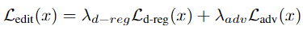
+ 减少失真的损失
+ 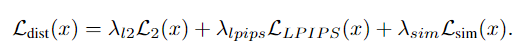
+ 总损失
+ 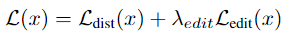

# (pSp)Encoding in Style: a StyleGAN Encoder for Image-to-Image Translation

## Motivation

+ W+空间比W空间好，但是不容易训练Encoder直接将图片映射到其中，之前都是通过优化的方式找到W+空间的隐向量，这很耗时

## Contribution

+ 提出了一个直接把图片映射到W+空间的Encoder，而不是像Image2Style那样使用优化的方式去找W+空间中的z
+ 提出了一个通用的！端到端的！能解决很多图像领域任务（反演、转正、修复、条件生成、超分、插值）的！框架。

## Model

+ 

+ 
+ **map2style**：a set of 2-strided convolutions followed by LeakyReLU activations

## Code

+ StyleMixing 中W+：随机采样z，8层全连接层生成w（相当于随机采样w），之后复制18份

+ Naive W+ 就是一个512到512*18的全连接网络来实现的

+ ```python
  if train:
      if Coach(opts):
          # 初始化网络
          if pSp(opts):
              # encoder_type == 'GradualStyleEncoder'、'BackboneEncoderUsingLastLayerIntoW'、'BackboneEncoderUsingLastLayerIntoWPlus'
              if psp_encoders.GradualStyleEncoder(num_layers=50, mode='ir_se', opts=opts):
                  if get_blocks(num_layers=50):
                      # 每一个block第一个Bottleneck修改通道数、降低一半特征图，后续几个Boottleneck不再修改
                      return "一个ResNet blocks" "后续传入unit_module中构建下采样网络"
              	if GradualStyleBlock(in_c=512, out_c=512, spatial=16/32/64): # 相当于Map2Style层，分别从对应的分便率下采样到一个Style
                  	return "那一层对应的风格"
                  return encoder
              decoder = Generator(self.opts.output_size, 512, 8)
              load_weights() # 直接加载训练好的pSp的checkpoints或预训练模型
              return pSp # Initialize network
          "训练所必须的初始化"
          # 开始训练
          if pSp.train():
              if pSp.forward():
                  if encoder.forward():
                      return codes # (18, 512)
                  if decoder.forward():
                      return images, result_latent
              if calc_loss(x, y, y_hat, latent):
                  # loss：论文中的总损失，loss_dict：存储各种损失，id_logs：见id_loss.py
                  return loss, loss_dict, id_logs
          "梯度反传"
          "优化"
  python scripts/inference.py \
  --exp_dir=/home/upc/Mydisk/UBT/my_pSp_test/experiment/church_con_7layer \
  --checkpoint_path=/home/upc/Mydisk/UBT/pSp_church_7layer/experiment/checkpoints/best_model.pt \
  --data_path=/home/upc/Mydisk/UBT/dataset/LSUN_church/church_outdoor_val \
  --test_batch_size=8 \
  --test_workers=4 \
  --couple_outputs
  
  python scripts/calc_losses_on_images.py \
  --mode lpips \
  --data_path=/home/upc/Mydisk/UBT/my_pSp_test/experiment/church_con_7layer/inference_results \
  --gt_path=/home/upc/Mydisk/UBT/dataset/LSUN_church/church_outdoor_val \
  
  # 训练church
  python scripts/train.py \
  --dataset_type=church_encode \
  --exp_dir=/home/upc/Mydisk/UBT/pSp_test/pSp_4/experiment \
  --workers=8 \
  --batch_size=2 \
  --test_batch_size=2 \
  --test_workers=8 \
  --val_interval=1000 \
  --save_interval=50000 \
  --encoder_type=GradualStyleEncoder \
  --start_from_latent_avg \
  --lpips_lambda=0.8 \
  --l2_lambda=1 \
  --output_size=256 \
  --stylegan_weights=/home/upc/Mydisk/UBT/Auxiliary_models/pSp/pretrained_models/stylegan2-church-config-f.pt \
  --max_steps=100000 \
  --optim_name=adam \
  --use_con \
  --con_lambda=0.0 \
  
  nohup >> /home/upc/Mydisk/UBT/pSp_test/pSp_4/church_train.log 2>&1 &
  
          
  ```
  
  

## Question

+ <u>Ranger optimizer</u>
+ 双立方下采样、双立方上采样
  + 其实都是双立方的形式，即使用某点映射到原图中点的附近16个点的像素值的加权和作为该点的像素值
  + 上采样和下采样其实都是一个映射函数，即`src_(x,y) = dst_(x,y) / scale`，其中缩放尺度`scale = dst / src`

+ 条件图像生成的训练和推理过程
  + source是输入到网路中的数据集，所以是草图或者分割图，target是要重建的图，所以是正常的图片
  + 因此在正常训练Encoder的时候source和target都是一样的数据集


# **ReStyle: A Residual-Based StyleGAN Encoder via Iterative Refinement**

## Model

+ 所提出架构中的Encoder可以是PSP或E4E，所以是一个通用架构
+ 
+ 作者通过Restyle方式减小了对Encoder的复杂度的要求，所以对PSP和E4E中使用的FPN结构进行简化，取得了近似的结果
+ 

# Interpreting the Latent Space of GANs for Semantic Face Editing

## Contribution

+ 提出InterFaceGAN，通过解释GAN学习到的潜在语义来进行语义面部编辑（2.2节上面探讨了多个属性之间的解耦性）
+ 提供一种人脸属性编辑方式，沿着对应属性方向进行线性编辑`z'=z+αn`

## Model

+ 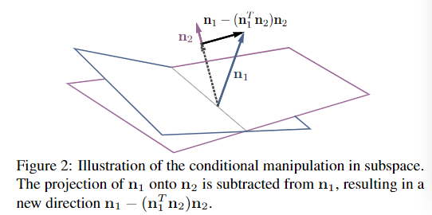
+ 每一个属性在隐空间中存在一个超平面作为分割界限，超平面的单位法向量定义为n。
+ 定义一个语义得分：得分函数为

  + 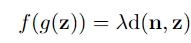

  + d：一个不太严格的距离定义，表示Latent code——z距离超平面的距离。

    + 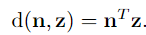

  + $$\lambda$$：度量语义随距离改变的速度
+ 有了这个新方向，沿着新方向移动z，就可以改变属性1而对属性2没有影响。（论文中称作conditional manipulation操作）
+ 同时，如果有多个属性需要条件化，我们只需减去原始方向到由所有条件化方向构成的平面上的投影。（如果有多个属性，就让需要修改的那个属性对应的单位法向量，依次减去其在其他所有属性的单位法向量上的投影，得到的新方向就是解耦了其他属性的修改方向，即修改这个属性，对其他属性没有影响。）

# (S-Space)StyleSpace Analysis: Disentangled Controls for StyleGAN Image Generation

## Motivation

+ 目前隐空间单个属性通常与其他属性耦合，解耦性不好

## Contribution

+ 提出一个解耦性更好的S空间
+ 提出两个方法：
  + 一个检测S向量的通道具体控制图像的哪一部分区域
  + 一个检测S向量的通道具体控制图像的哪一种属性

+ 一个新的解耦性评价指标：Attribute Dependency（AD）：
  + 度量沿着某个方向的操作在多大程度上引起了其他属性的变化，可以通过这些属性的分类器来度量
  + AD越低，解纠缠越好


## Model

+ 
+ **w1 → s1, w2 → s2, w2 → stRGB。在 W 空间中，w1 和 w2 是相同的向量，且所有层都相同。在 W+ 空间中，w1 和 w2 是两个不同的向量，且每个主要层都有自己的对 (w1, w2)**
+ 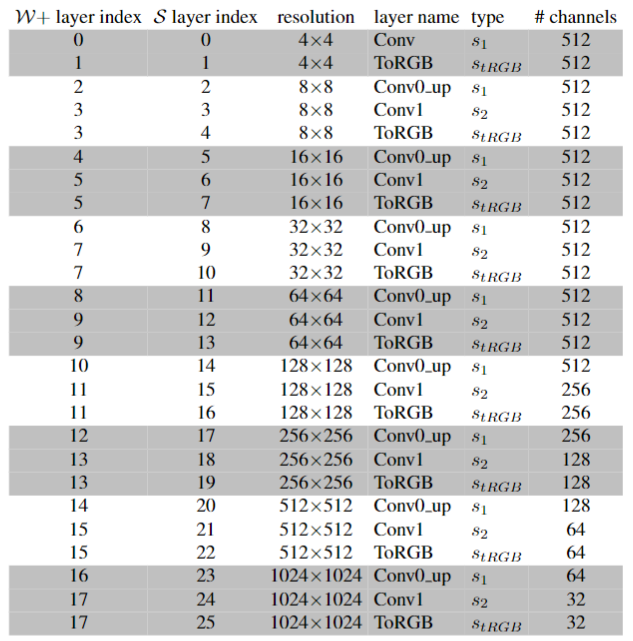
+ **S空间的各个层**

## Question

+ DCI计算
+ 梯度图的计算

# (HyperStyle)StyleGAN Inversion with HyperNetworks for Real Image Editing

## Motivation

+ 原来的方法应用在大规模真实场景中还是有一定限制，理由为下一点
+ 直接基于调整生成器的方法不现实且需要依据具体的每个输入的目标图像去优化生成器，学习时间较长（PTI）
+ 之前基于训练超网络的方法参数量过大

## Contribution

+ 提出一个超网络（HyperNetwork）：学习调节 StyleGAN 的权重，以在潜在空间的可编辑区域中忠实地表达给定图像。
+ 模型参数量减少到与现存继续Encoder的方法的参数量相差不多
+ 重建效果好（基于学习的时间内逼近基于优化的效果）
+ 提出一个新的度量模型编辑性的方法：使用不同步长范围进行编辑，并沿此范围绘制测量的单位相似度，从而为每种反演方法绘制连续的相似度曲线。
  + 因为不同的反演方法，使用相同的编辑步长会产生不同的编辑强度，这给身份相似性的测量带来偏差

## Model

+ 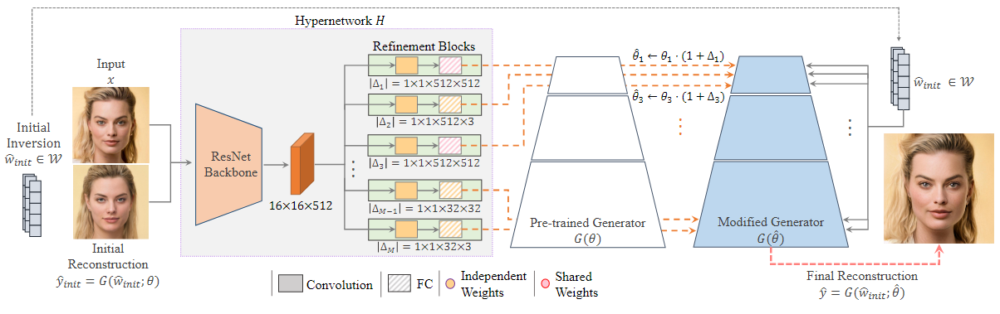
  + 使用共享细化块（块内的卷积层是独立的，进行特征图的下采样，只是后接两个共享的全连接层）：只在1\*1\*512\*512之间共享
  + 只对mid和fine部分的非toRGB层进行权重修改
    + 实验证明修改toRGB层会影响编辑性
    + 初始化反演倾向于捕捉粗粒度部分
  + 借鉴Restyle的思想对于一个目标图像循环训练几次H

## Question

+ 推理的时候也是循环几次吗？
+ 如何理解文中提出的能够泛化到外域图像（ps：这里的外域是需要有相似语义信息的域）：
  + 在源域上训练的H，直接拿来对目标域生成器进行修改（！此时初始重建是源域生成器生成还是目标域生成器生成）
  + 直接对H和G训练过程中从未见过的图像域进行反演和编辑

# (PTI)Pivotal Tuning for Latent-based Editing of Real Images

## Motivation

+ 在对域外的面部（模型训练过程中从未见过的人脸）进行反演和编辑的时候，仍然具有挑战性

## Contribution

+ 提出一种调整生成器权重的方法(PTI)，能够将域外的图像忠实地映射到域内Latent Code
+ 对浓妆、头饰等也能很好的反演和编辑

## Model

+ 分两步：invert和tune
+ 首先找到图像的一个初始反演Latent Code（Wp：pivot code）
  + 使用基于StyleGAN直接优化的方式找到
  + 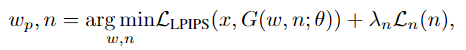
+ 找到Wp后，基于它对生成器参数进行优化
  + 
  + 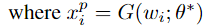
  + ps：不是在大量图形上训练生成器，而是特定于目标图像进行生成器微调
+ **Locality Regularization**：解决ripple效应——使用非局部LC生成的图像质量会被破坏，引入LR目的将PTI变化限制在隐空间的局部区域
  + 随机sample一个z，StyleGAN中8层全连接层计算Wz，与Wp计算Wr，用Wr输入微调前后的生成器得到${x_r}$和$x_r^*$，计算两者的损失。
  + 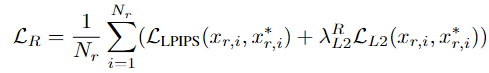

+ 最终生成器的优化定义为：
  + 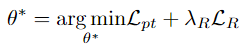

## Question

+ 什么是隐空间的局部区域，非局部LC生成？

# (PadInv)High-fidelity GAN Inversion with Padding Space

## Motivation

+ 现有的方法对空间细节恢复不足（即图像中有手、帽子等分布外的信息）
+ 零填充带来了感应偏差

## Contribution

+ 提出一个P空间作为W+空间的补充，能够更好的恢复图像的空间信息，特别是对分布外的对象
+ 设计了一个Encoder，不仅能生成W+，同时还能生成P
+ 验证了P空间能够更好的控制图像的人脸姿态、形状和背景等结构信息；W+空间控制图像的人脸身份、口红、色彩等风格信息
  + 不需要先验知识就可以实现各自编辑，而不影响其他的属性

## Model

+ 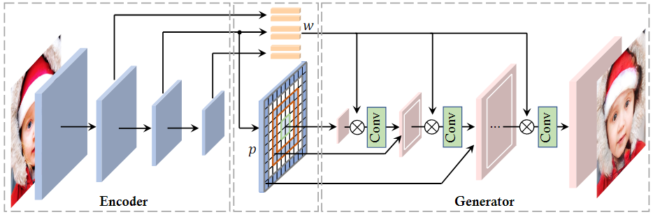
+ P的生成：选择一个最大的分辨率（实验证明32*32最好），在FPN对应的大小（512\*32\*32）进行1\*1卷积后进行上采样到34\*34大小，因此这里就最大对32分辨率的特征图使用可学习的padding
+ 每个分辨率有两个卷积层，只有一个卷积层（后一个）使用P空间的padding，其他层的padding保持不动
+ P0标志着StyleGAN中的常数输入（视为0\*0的张量的padding）
