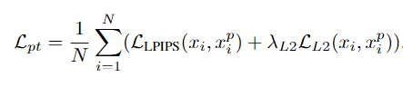
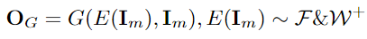
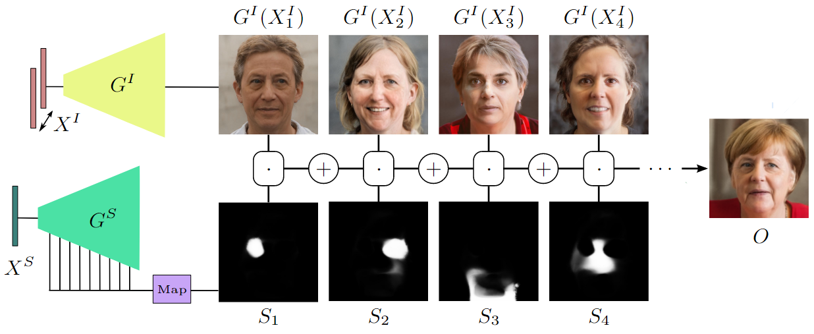
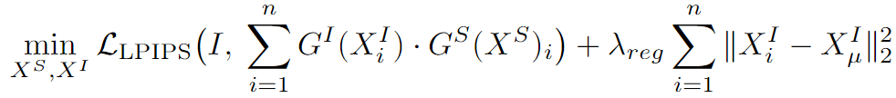
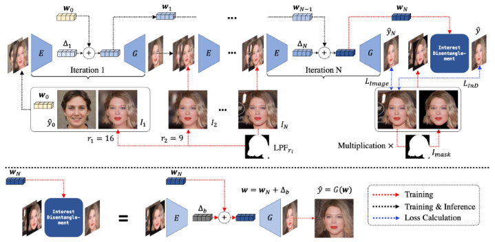

# 领域知识：

+ 一般有基于优化和基于学习的方式
+ 基于优化的方法迭代次数多，训练时间长，但是选择合适的空间，重建能力很强，不过因为不容易控制隐变量的分布，所以得到的z不适合编辑（脱离预训练生成器的隐空间）
+ 基于学习的方法速度快，但是重构能力低，需要设计很好的网络结构和损失，以及好的训练Encoer的方法

# Image2StyleGAN: How to Embed Images Into the StyleGAN Latent Space?

## Contribution

+ 提出一种基于优化的GAN反演方法
+ 提出一个新的W+隐空间
+ 对隐空间的特性进行研究

## Method

+ 

## Question

+ 基于优化的方法是不是也受限于生成器的预训练数据集？
  + image2style解释了，生成效果不太受限于stylegan生成器预训练的数据集，不过在人脸ffhq上训练后，在人脸类和其他类都有不错的反演效果，包括插值属性也不错，但在猫、卧室等数据集上训练的生成器，反演其他的类别图像效果就会弱很多，可能是因为人脸的分布与其他类别数据分布的重合导致。
+ 后续文章也证明，完全基于优化的方法，隐向量Z的可编辑性很不好，因为已经把Z优化出了GAN预训练的隐空间（富含语义信息）
  + 在人脸数据集上训练的StyleGAN，对人脸的插值还可以，对其他类别图像的插值识别不出来
  + 在其他类图像（车、猫、卧室）数据集上训练的StyleGAN，对其自身和其他类图像的线性插值效果都很差

# Image2StyleGAN++: How to Edit the Embedded Images?

## Contribution

+ 对前作进行一些改进
+ 算法允许缺失、局部近似嵌入等局部被修改的图像的反演
+ <u>embedding和activation tensor manipulation结合，提高全局语义编辑和局部编辑的效果</u>
+ 得到的隐向量对下游的图像编辑效果更好

## Method

+ 优化的隐向量不仅是W+空间中的w，同时还有一个噪声向量n
  + （w，n）共同重建图像，共同梯度优化，先优化w后n
  + 确保尽可能多的信息被编码在 w 中，并且仅在噪声空间中编码高频细节
+ 优化的时候使用三种spatial masks，提高算法的局部编辑能力
+ 

# In-Domain GAN Inversion for Real Image Editing

## Motivation

+ 直接对Z进行基于学习的反演，重建效果很差
+ 直接基于优化的方法，Z的可编辑性又差，因为没有重复利用与训练的GAN的隐空间的语义信息

## Contribution

+ 提出两部优化，domain-guided和domain-regularized
  + 前者学习一个Encoder
    + 对于重建图像并不是计算和真实图像的距离，而是通过判别器判别哪个是真实图像哪个是重建图像
  + 后者把Encoder当作一个正则项。在给定目标图像后，一是用来找到一个初始化Z，二是能够在优化Z的时候作为一个正则项，使优化的Z尽可能的在GAN的语义空间内。就是加入一个新的损失-每次生成的图片经过E得到一个Z去和原Z计算损失（文中称域内损失）。作者说可以把充分利用生成器的域的语义信息，通过E把Z限制到与训练的G的隐空间域，使Z带有更多的语义信息，但如此肯定会影响Z的一个图像重建效果。

## Model

+ 

## Code

+ W空间和W+空间，前者输到生成器每一层A的w都是一样的（类似正常StyleGAN训练时的输入），后者不一样（所以有18个不同的w，这18个不同的w就构成了W+空间）

+ 虽然图中，easy_synthesize获得W+空间得隐向量得时候，18个w相同，但如果在W+空间上进行反演，那么优化后就会有18个不同的w，相对应，如果是在W空间上进行反演，那么经过truncation后还是会得到18个相同的w输入到StyleGAN生成器每一层对应的A中

+ 其中输入到生成器中的隐向量均是未经过风格调制层A的，A属于训练好的生成器的范围内；因此无论是W还是W+空间，输入到生成器中的隐向量都会经过一个A，将隐向量变换成Style（对于每一个卷积层）(甚至到了StyleGAN，都没有A了)
  + stylegan_generator_network.py
    + EpilogueBlock：每个卷积层后的操作，包括噪声、风格调制等
    + StyleModulationLayer：即风格调制层，其中包括所说的A（DenseBlock）
  
+ 

  <!--可能错误-->

## Question

+ 推理时，给Encoder输入一个训练数据分布以外的图像，效果会很差。训练时如果使用的数据集和GAN生成器预训练的数据集不同，训练出来的Encoder可能也会很差。说明训练过程还是比较依赖GAN生成器预训练的那个数据集的分布。这很大程度上限制了许多Image-to-Image tasks。

# (e4e)Designing an Encoder for StyleGAN Image Manipulation

+ 深入研究distortion和editability（perception）的权衡。重构图片的效果、可编辑性的强弱，分别用distortion和editability代表，distortion低（表示重构图片效果较好）的一般editability能力弱。

## Contribution

+ 仔细研究了隐空间，对隐空间类别进行更精细的解耦和分析，希望得到一个在重建质量与（可编辑性、感知质量）两者间的权衡
+ 分两步训练一个编码器，使W*k空间向W空间靠拢，希望牺牲较少的重建质量，得到更好的编辑性，约束编辑效果
+ 同时使用L2和lpips和id_loss共同来约束失真效果

## Model

+ 
+ 提高感知和编辑能力的损失
+ 
+ 
+ 
+ 减少失真的损失
+ 
+ 总损失
+ 

# (pSp)Encoding in Style: a StyleGAN Encoder for Image-to-Image Translation

## Motivation

+ W+空间比W空间好，但是不容易训练Encoder直接将图片映射到其中，之前都是通过优化的方式找到W+空间的隐向量，这很耗时

## Contribution

+ 提出了一个直接把图片映射到W+空间的Encoder，而不是像Image2Style那样使用优化的方式去找W+空间中的z
+ 提出了一个通用的！端到端的！能解决很多图像领域任务（反演、转正、修复、条件生成、超分、插值）的！框架。

## Model

+ 

+ 
+ **map2style**：a set of 2-strided convolutions followed by LeakyReLU activations

## Code

+ StyleMixing 中W+：随机采样z，8层全连接层生成w（相当于随机采样w），之后复制18份

+ Naive W+ 就是一个512到512*18的全连接网络来实现的

+ ```python
  if train:
      if Coach(opts):
          # 初始化网络
          if pSp(opts):
              # encoder_type == 'GradualStyleEncoder'、'BackboneEncoderUsingLastLayerIntoW'、'BackboneEncoderUsingLastLayerIntoWPlus'
              if psp_encoders.GradualStyleEncoder(num_layers=50, mode='ir_se', opts=opts):
                  if get_blocks(num_layers=50):
                      # 每一个block第一个Bottleneck修改通道数、降低一半特征图，后续几个Boottleneck不再修改
                      return "一个ResNet blocks" "后续传入unit_module中构建下采样网络"
              	if GradualStyleBlock(in_c=512, out_c=512, spatial=16/32/64): # 相当于Map2Style层，分别从对应的分便率下采样到一个Style
                  	return "那一层对应的风格"
                  return encoder
              decoder = Generator(self.opts.output_size, 512, 8)
              load_weights() # 直接加载训练好的pSp的checkpoints或预训练模型
              return pSp # Initialize network
          "训练所必须的初始化"
          # 开始训练
          if pSp.train():
              if pSp.forward():
                  if encoder.forward():
                      return codes # (18, 512)
                  if decoder.forward():
                      return images, result_latent
              if calc_loss(x, y, y_hat, latent):
                  # loss：论文中的总损失，loss_dict：存储各种损失，id_logs：见id_loss.py
                  return loss, loss_dict, id_logs
          "梯度反传"
          "优化"
  python scripts/inference.py \
  --exp_dir=/home/upc/Mydisk/UBT/pSp_test_exp/pSp_2_face \
  --checkpoint_path=/home/upc/Mydisk/UBT/Auxiliary_models/pSp/pretrained_checkpoint/psp_ffhq_encode.pt \
  --data_path=/home/upc/Mydisk/UBT/dataset/CelebAHQ/test \
  --test_batch_size=8 \
  --test_workers=4 \
  --couple_outputs
  
  --data_path=/home/upc/Mydisk/UBT/dataset/CelebAHQ/test/ 
  
  
  python scripts/calc_losses_on_images.py \
  --mode lpips \
  --data_path=/home/upc/Mydisk/UBT/pSp_test_exp/pSp_1_face/inference_results \
  --gt_path=/home/upc/Mydisk/UBT/dataset/CelebAHQ/test/ \
  
  --gt_path=/home/upc/Mydisk/UBT/dataset/LSUN_church/church_outdoor_val
  
  python scripts/calc_id_loss_parallel.py \
  --data_path=/home/upc/Mydisk/UBT/pSp_test_exp/pSp_2_face/inference_results \
  --gt_path=/home/upc/Mydisk/UBT/dataset/CelebAHQ/test/  \
  
  # 训练church
  HFGI的判别损失和ChunkGAN的平局代码惩罚项加入会不会提高效果？
  
  1无con————>L2优化到最低0.094
  2con系数为0
  3关闭不相关网络的梯度
  4训练F时加了.detach() con系数为0——>pSp正常用loss优化
  5con系数为0.01
  6con系数为0.05
  7只用con损失，系数为1——>根本没有优化到Encoder
  8训练F时取消.detach()，F和pSp全部用一次梯度反传的con来优化，因此层数设置较多，但是net的参数梯度设置为False————>优化不到pSp
  9训练F时取消.detach()，F和pSp全部用一次梯度反传的con来优化，因此层数设置较多，net的参数梯度设置为True————>L2损失爆炸，（为什么生成图变得那么奇怪）
  10训练F时取消.detach()，F和pSp全部用一次梯度反传的con来优化，只使用原图的一层
  11计算一次损失反传后，F和pSp一起优化，con系数0.1，层数[0, 3, 20, 23]————>L2优化到最低0.094
  12计算一次损失反传后，F和pSp一起优化，con系数0.5，层数[0, 3, 20, 23]————>L2优化到最低0.085
  13计算一次损失反传后，F和pSp一起优化，con系数0.8，层数[0, 3, 20, 23]————>L2优化到最低0.087
  14计算一次损失反传后，F和pSp一起优化，con系数1，层数[0, 3, 20, 23]————>L2优化到最低0.086
  15先优化F，后优化pSp，这样F的优化损失就不会随着con变化？同时优化pSp时相当于con系数为1？————>L2优化到最低0.099
  16只用lpips和con进行优化，系数都为1————>最低优化到0.096，l2仍然能正常优化
  17调整层数，不使用16*16的特征图，只是用到输入的1/8（E2style）————>L2优化到最低0.084，但是相比12，lpips更高
  18计算一次损失反传后，F和pSp一起优化，con系数1，层数[0, 2, 3, 6, 7, 20, 21, 23]————>L2优化到最低0.085，但是相比12，lpips更高
  19加入moco损失，moco系数0.5，con系数0.5————>L2优化到最低0.093，Lpips：0.415
  20加入moco损失，不用con————>L2优化到最低0.118，Lpips：0.389
  21用上采样后的特征图进行损失计算
  
  
  python scripts/train.py \
  --dataset_type=ffhq_encode \
  --exp_dir=/home/upc/Mydisk/UBT/pSp_test/face_1/experiment2 \
  --workers=8 \
  --batch_size=2 \
  --test_batch_size=2 \
  --test_workers=8 \
  --val_interval=1000 \
  --save_interval=50000 \
  --encoder_type=GradualStyleEncoder \
  --start_from_latent_avg \
  --lpips_lambda=0.8 \
  --l2_lambda=1 \
  --id_lambda=0.1 \
  --output_size=256 \
  --max_steps=150000 \
  --optim_name=adam \
  --use_con \
  --con_lambda=1 \
  --checkpoint_path=/home/upc/Mydisk/UBT/pSp_test/face_1/experiment/checkpoints/iteration_350000.pt \
  
  
  --dataset_type=church_encode \
  --stylegan_weights=/home/upc/Mydisk/UBT/Auxiliary_models/pSp/pretrained_models/stylegan2-church-config-f.pt \
  --moco_lambda=0.5 \
  
  nohup >> /home/upc/Mydisk/UBT/pSp_test/face_1/church_train2.log 2>&1 &
          
  ```
  
  

## Question

+ <u>Ranger optimizer</u>
+ 双立方下采样、双立方上采样
  + 其实都是双立方的形式，即使用某点映射到原图中点的附近16个点的像素值的加权和作为该点的像素值
  + 上采样和下采样其实都是一个映射函数，即`src_(x,y) = dst_(x,y) / scale`，其中缩放尺度`scale = dst / src`

+ 条件图像生成的训练和推理过程
  + source是输入到网路中的数据集，所以是草图或者分割图，target是要重建的图，所以是正常的图片
  + 因此在正常训练Encoder的时候source和target都是一样的数据集


# **ReStyle: A Residual-Based StyleGAN Encoder via Iterative Refinement**

## Model

+ 所提出架构中的Encoder可以是PSP或E4E，所以是一个通用架构
+ 
+ 作者通过Restyle方式减小了对Encoder的复杂度的要求，所以对PSP和E4E中使用的FPN结构进行简化，取得了近似的结果
+ 

## Code

+ 前20000之前，都是用最后一层提取的w0并复制18份，即找到的是W空间，20000step之后开始慢慢优化delta，希望使w空间像w+空间优化，达到更好的优化效果（e4e）
+ restyle的迭代与上一条概念上无关，只是每个batch优化迭代5次进入下一个batch。

+ ```python
  # CUDA 11.3
  pip install torch==1.12.1+cu113 torchvision==0.13.1+cu113 torchaudio==0.12.1 --extra-index-url https://download.pytorch.org/whl/cu113
  
  restyle_e4e_church_encode_con1:con系数0.5
  
  python scripts/train_restyle_e4e.py \
  --dataset_type=horse_encode \
  --encoder_type=ResNetProgressiveBackboneEncoder \
  --exp_dir=experiment/restyle_e4e_horse_encode_con2 \
  --workers=8 \
  --batch_size=8 \
  --test_batch_size=8 \
  --test_workers=8 \
  --start_from_latent_avg \
  --lpips_lambda=0.8 \
  --l2_lambda=1 \
  --delta_norm_lambda 0.0002 \
  --id_lambda 0 \
  --moco_lambda 0.5 \
  --use_w_pool \
  --w_discriminator_lambda 0.1 \
  --progressive_start 20000 \
  --progressive_step_every 2000 \
  --input_nc 6 \
  --n_iters_per_batch=5 \
  --output_size 256 \
  --save_interval 20000 \
  --stylegan_weights=/HDDdata/LQW/Auxiliary_models/pSp/pretrained_models/stylegan2-horse-config-f.pt \
  --max_steps 100000 \
  --use_con \
  --con_lambda=1
  
  nohup >> /HDDdata/LQW/restyle-encoder-main/experiment/restyle_e4e_horse_encode_con2/train.log 2>&1 &
  
  python scripts/inference_iterative.py \
  --exp_dir=/HDDdata/LQW/restyle-encoder-main/experiment/restyle_e4e_horse_encode_con/inference \
  --checkpoint_path=/HDDdata/LQW/restyle-encoder-main/experiment/restyle_e4e_horse_encode_con/checkpoints/best_model.pt \
  --data_path=/HDDdata/LQW/Restyle_Horse/test \
  --test_batch_size=4 \
  --test_workers=4 \
  --n_iters_per_batch=5
  
  python scripts/inference_iterative_save_coupled.py \
  --exp_dir=/HDDdata/LQW/restyle-encoder-main/experiment/restyle_e4e_church_encode_con1/inference/couple \
  --checkpoint_path=/HDDdata/LQW/restyle-encoder-main/experiment/restyle_e4e_church_encode_con1/checkpoints/best_model.pt \
  --data_path=/HDDdata/LQW/LSUN_church/church_outdoor_val \
  --test_batch_size=4 \
  --test_workers=4 \
  --n_iters_per_batch=5
  
  python scripts/calc_losses_on_images.py \
  --mode lpips \
  --output_path=/HDDdata/LQW/restyle-encoder-main/experiment/restyle_e4e_horse_encode/inference/inference_results \
  --gt_path=/HDDdata/LQW/Restyle_Horse/test
  
  python -m pytorch_fid /HDDdata/LQW/Restyle_Horse/test_cv2_transform_256 /HDDdata/LQW/restyle-encoder-main/experiment/restyle_e4e_horse_encode/inference/inference_results/4 --device cuda:0
  
  python calculate_psnr_ssim.py \
  --mode SSIM \
  --data_path /HDDdata/LQW/restyle-encoder-main/experiment/restyle_e4e_horse_encode_con/inference/inference_results/4 \
  --gt_path /HDDdata/LQW/Restyle_Horse/test 
  ```
  
  

# (InterFace GAN)Interpreting the Latent Space of GANs for Semantic Face Editing

## Contribution

+ 提出InterFaceGAN，通过解释GAN学习到的潜在语义来进行语义面部编辑（2.2节上面探讨了多个属性之间的解耦性）
+ 提供一种人脸属性编辑方式，沿着对应属性方向进行线性编辑`z'=z+αn`

## Model

+ 
+ 每一个属性在隐空间中存在一个超平面作为分割界限，超平面的单位法向量定义为n。
+ 定义一个语义得分：得分函数为

  + 

  + d：一个不太严格的距离定义，表示Latent code——z距离超平面的距离。

    + 

  + $$\lambda$$：度量语义随距离改变的速度
+ 有了这个新方向，沿着新方向移动z，就可以改变属性1而对属性2没有影响。（论文中称作conditional manipulation操作）
+ 同时，如果有多个属性需要条件化，我们只需减去原始方向到由所有条件化方向构成的平面上的投影。（如果有多个属性，就让需要修改的那个属性对应的单位法向量，依次减去其在其他所有属性的单位法向量上的投影，得到的新方向就是解耦了其他属性的修改方向，即修改这个属性，对其他属性没有影响。）

# (GAN Space)GANSpace: Discovering Interpretable GAN Controls

## 图像编辑

+ 

## Model

+ 通过在GAN的隐空间中应用PCA，可以找到重要的编辑方向
+ PCA编辑方向可以进行分层分解控制
  + 给定一个潜在向量w的图像，逐层编辑需要只修改w个输入到一定范围的层，而保持其他层的输入不变
  + E(v1, 0-3)表示仅在前四层沿分量v1移动
+ 方法发现：几何结构和视点的大规模变化仅限于前20个主成分（v0-v20）；前100个主成分足以描述整体图像外观；剩下的412个维度控制着外观上细微但可察觉的变化

# (S-Space)StyleSpace Analysis: Disentangled Controls for StyleGAN Image Generation

## Motivation

+ 目前隐空间单个属性通常与其他属性耦合，解耦性不好

## Contribution

+ 提出一个解耦性更好的S空间
+ 提出两个方法：
  + 一个检测S向量的通道具体控制图像的哪一部分区域
  + 一个检测S向量的通道具体控制图像的哪一种属性

+ 一个新的解耦性评价指标：Attribute Dependency（AD）：
  + 度量沿着某个方向的操作在多大程度上引起了其他属性的变化，可以通过这些属性的分类器来度量
  + AD越低，解纠缠越好


## Model

+ 
+ **w1 → s1, w2 → s2, w2 → stRGB。在 W 空间中，w1 和 w2 是相同的向量，且所有层都相同。在 W+ 空间中，w1 和 w2 是两个不同的向量，且每个主要层都有自己的对 (w1, w2)**
+ 
+ **S空间的各个层**

## Question

+ DCI计算

# (HyperStyle)StyleGAN Inversion with HyperNetworks for Real Image Editing

## Motivation

+ 原来的方法应用在大规模真实场景中还是有一定限制，理由为下一点
+ 直接基于调整生成器的方法不现实且需要依据具体的每个输入的目标图像去优化生成器，学习时间较长（PTI）
+ 之前基于训练超网络的方法参数量过大

## Contribution

+ 提出一个超网络（HyperNetwork）：学习调节 StyleGAN 的权重，以在潜在空间的可编辑区域中忠实地表达给定图像。
+ 模型参数量减少到与现存继续Encoder的方法的参数量相差不多
+ 重建效果好（基于学习的时间内逼近基于优化的效果）
+ 提出一个新的度量模型编辑性的方法：使用不同步长范围进行编辑，并沿此范围绘制测量的单位相似度，从而为每种反演方法绘制连续的相似度曲线。
  + 因为不同的反演方法，使用相同的编辑步长会产生不同的编辑强度，这给身份相似性的测量带来偏差

## Model

+ 
  + 使用共享细化块（块内的卷积层是独立的，进行特征图的下采样，只是后接两个共享的全连接层）：只在1\*1\*512\*512之间共享
  + 只对mid和fine部分的非toRGB层进行权重修改
    + 实验证明修改toRGB层会影响编辑性
    + 初始化反演倾向于捕捉粗粒度部分
  + 借鉴Restyle的思想对于一个目标图像循环训练几次H

## Question

+ 推理的时候也是循环几次吗？
+ 如何理解文中提出的能够泛化到外域图像（ps：这里的外域是需要有相似语义信息的域）：
  + 在源域上训练的H，直接拿来对目标域生成器进行修改（！此时初始重建是源域生成器生成还是目标域生成器生成）
  + 直接对H和G训练过程中从未见过的图像域进行反演和编辑

# (PTI)Pivotal Tuning for Latent-based Editing of Real Images

## Motivation

+ 在对域外的面部（模型训练过程中从未见过的人脸）进行反演和编辑的时候，仍然具有挑战性

## Contribution

+ 提出一种调整生成器权重的方法(PTI)，能够将域外的图像忠实地映射到域内Latent Code
+ 对浓妆、头饰等也能很好的反演和编辑

## Model

+ 分两步：invert和tune
+ 首先找到图像的一个初始反演Latent Code（Wp：pivot code）
  + 使用基于StyleGAN直接优化的方式找到
  + 
+ 找到Wp后，基于它对生成器参数进行优化
  + 
  + 
  + ps：不是在大量图形上训练生成器，而是特定于目标图像进行生成器微调
+ **Locality Regularization**：解决ripple效应——使用非局部LC生成的图像质量会被破坏，引入LR目的将PTI变化限制在隐空间的局部区域
  + 随机sample一个z，StyleGAN中8层全连接层计算Wz，与Wp计算Wr，用Wr输入微调前后的生成器得到${x_r}$和$x_r^*$，计算两者的损失。
  + 

+ 最终生成器的优化定义为：
  + 

## Question

+ 什么是隐空间的局部区域，非局部LC生成？

# (PadInv)High-fidelity GAN Inversion with Padding Space

## Motivation

+ 现有的方法对空间细节恢复不足（即图像中有手、帽子等分布外的信息）
+ 零填充带来了感应偏差

## Contribution

+ 提出一个P空间作为W+空间的补充，能够更好的恢复图像的空间信息，特别是对分布外的对象
+ 设计了一个Encoder，不仅能生成W+，同时还能生成P
+ 验证了P空间能够更好的控制图像的人脸姿态、形状和背景等结构信息；W+空间控制图像的人脸身份、口红、色彩等风格信息
  + 不需要先验知识就可以实现各自编辑，而不影响其他的属性

## Model

+ 
+ P的生成：选择一个最大的分辨率（实验证明32*32最好），在FPN对应的大小（512\*32\*32）进行1\*1卷积后进行上采样到34\*34大小，因此这里就最大对32分辨率的特征图使用可学习的padding
+ 每个分辨率有两个卷积层，只有一个卷积层（后一个）使用P空间的padding，其他层的padding保持不动
+ P0标志着StyleGAN中的常数输入（视为0\*0的张量的padding）

# (HFGI)High-Fidelity GAN Inversion for Image Attribute Editing

## Motivation

+ 因为Latent Code的维度低的原因，所以重建的图像不可避免的会丢失一些信息，丢失的主要是高频细节信息
+ 对有极端视点和遮挡的图像的重建效果很差

## Contribution

+ 为了实现高保真度反演，提出了一个失真咨询分支来传递具体图像的高频信息
+ 为了高保真编辑，设计了一个自适应失真对齐模块（ADA）
  + ADA的训练：
    + GT：$\Delta  = X - {\widehat X_O}$——真实图像-粗重建图像
    + 对GT进行随机透视变换得到$\widetilde \Delta $
    + 经过ADA模块得到：$\widehat \Delta  = ADA({\widehat X_O},\widetilde \Delta)$
    + 计算对齐损失(alignment loss)：$||\widehat \Delta  - \Delta |{|_1}$

## Model

+ 
+ 总损失：
  + 
  + 
  + 
+ 训练过程中只包含反演图像，不需要编辑方向；训练之后，模型可以推广到使用不同的编辑方法进行属性编辑

## Code

+ 判别损失是如何加入的

# (InvertFill)High-Fidelity Image Inpainting with GAN Inversion

## Motivation

+ 图像修复问题中，对于退化严重的图像，即缺失部分很多的图像修复存在挑战
+ 基于GAN反演的图像修复存在“gapping”问题：由于GAN模型并不直接访问输入图像像素，所以缺失修复问题中的硬约束（没有被mask掉的像素应在重建时得到一致的保留）没有得到解决，最终导致颜色差异和语义不一致性
+ 训练的模型对于域外图像的修复存在问题

## Contribution

+ 引入一个新的F&W+隐空间，解决“gapping”问题，弥补了GAN反演用于图像修复时无法直接观察到未掩码像素的问题
+ 提出一个多尺度的预调制网络，更加充分的利用多尺度的输入信息
+ 使用软更新平均隐向量来修正输入到生成器中的隐向量（之所以这么做是因为，如果不修正，则可能出现：修复的图像中，远离掩码边缘的像素出现模糊的现象），解决使用静态平均向量优化带来的失去生成多样性的问题
+ 提出的模型，用到生成器未见过的域时也能有很好的效果，只需要单独训练对应的编码器即可，而不需要再去训练StyleGAN生成器

## Model

+ 
+ Encoder投喂的也是退化图像，生成的Oe是通过3个RGB_heads得到的重建出来的RGB图像

## Loss

+ 
+ 
  + 
  + 计算I与Og之间的损失（未掩码、掩码像素损失、感知损失、风格损失、总变异损失）
  + 
  + 计算I与Oe之间的损失
  + 
    + 
  + 提高输出图像的质量和多样性

# Spatially-Adaptive Multilayer Selection for GAN Inversion and Editing

## Motivation

+ 现有方法更多的针对有规则的图像，比如人脸和动物脸，对于复杂图像，比如汽车、马，以为视觉特征更多样、背景更复杂，而且经常会遇到遮挡问题，使得这些图像的反演更加有挑战
+ 图像的不同区域的反演难度不同，因为有些背景信息在预训练的数据集中出现的频率低，导致不容易反演

## Contribution

+ 训练一个网络能够对于输入图像上不同区域应该用哪个隐空间进行预测
+ 通过使用多个隐空间，对输入图像的每个不同区域进行反演
  + 对需要编辑的部分使用W+空间
  + 对背景等信息使用生成器后面层进行反演——能够能精确的重建图像但降低编辑能力

## Model

+ 训练一个预测网络来推断输入图像的`Invertibility map`：指示每个区域要使用的隐空间
+ 
  + 左侧：使用不同隐空间的得到的反演图像对，通过`LPIPS`得到`LPIPS spatial error map`，然后训练一个网路——给定输入图像能够预测出对应的`LPIPS spatial error map`，不同的隐空间对应不同的网络
  + 右侧：得到最终`Invertibility map`的过程，给定输入图像，通过左侧预训练的网络得到对应不同隐空间的`LPIPS s·patial error map`，之后通过预训练的图像分割网络做微调，最后对C通过设定的阈值τ来组合他们得到`Invertibility map`
+ 
  + 需要预测的是$\Delta {f_i}$，`Invertibility map`使用双线性下采样得到对应特征图大小的二进制掩码图：来指示该层中应该反转的区域
  + 
  + 
  + 基于优化的方法，直接优化每张图像的隐空间集合`Φ = {W +, F4, F6, F8, F10}`
  + 基于编码器的方法，则为每个隐空间训练一个单独的编码器
+ 使用更强大的隐空间层F4和F6重建困难区域，容易生成的区域使用更可编辑的W+

+ 根据`Invertibility map`对图像进行编辑：在W+空间中反转的区域被整个编码w + δw+调制，而在中间特征空间{F4, F6, F8, F10}中反转的区域仅在该特征空间层之后的层中被w + δw+调制
+ 实验结果能够对一般都希望编辑的简单区域能够进行很好编辑，对于一般不期待编辑的背景等信息则有更好的重建，比如因为预训练的网络关注的是车，所以对车本身重建更简单，对背景重建较难，使用这种方法实现对编辑和重建的权衡。

## Question

+ 训练`Invertibility map`的时候，直接使用单层F10来生成反演图？

# ChunkyGAN:：Real Image Inversion via Segments

## Motivation

+ 之前的方法使用一个LT代表整张图像，因为维度差距过大，LT的表现力会严重不足
+ 通过重建损失进行优化得到的整张图像的最小值并不一定在所有图像的区域都是最小值

## Contribution

+ 提出一个基于GAN的图像重建和编辑技术，将输入图像细分为一组区域，不同的区域用不用的LT去反演
  + 由一个低得多的维度目标去寻找反演代码，使优化更容易

+ 对人脸编辑强度的一种度量方式
  + 为每个语义方向使用一个分类器，对于每个空间和方法，用分类器的response衡量和调整编辑强度

## Model

+ 
+ 输出图像是n张图像的加权组合
  + 权重可以自己手动指定，也可以用一个segment latent code XS通过一个生成器，生成每个区域的mask
  + 生成的不同图像和mask的个数对应，也就是有多少个mask，就有多少个XL（XL可以位于W、W+、S不同空间，其中W+空间表现最好），就有多少张生成的图像，最终加权合并成一张最终输出
+ 损失函数：
  + 
  + 第一项是LPIPS，第二项是惩罚LT的离散程度的正则项，加入后对最终结果的重建效果略有降低，但是编辑效果有更明显的提升
+ 掩码图像和生成图像在训练过程中均被不断优化

## Code

+ 惩罚离散损失如何加入（平均代码如何获得）：论文中说有助于避免产生真实图像的太远的潜在代码

## Question

+ 论文中红色部分

# E2Style: Improve the Efficiency and Effectiveness of StyleGAN Inversion

## Motivation

+  GAN反演问题对效率和有效性都有很高要求
+ 现有的方法，基于学习的有效性不好、基于优化的效率不高，而一般的混合方法也会因为优化操作的引入而导致效率降低
+ 基于学习的前馈型方法网络结构设计的并不合理

## Contribution

+ 提出了一个新的用于GAN反演的网络架构
+ 研究了网络深度、隐向量预测头的设计对最终效果的影响

## Model

+ 
  + 主网络只降低到输入分辨率的1/8
  + 1/2、1/4、1/8都是用一个高效映射头，由一个全局池化和一个全连接层组成
  + 同时引入多阶段微调，训练完一个阶段的网络后，固定住，然后开始训练下一个阶段的网络，每个阶段的网络是独立的、单独训练的
    + 
    + 
    + 后续阶段的学习目标是预测残差
    + 虽然加入了多阶段优化，但是推理的时候仍然是只需要向前传第一次就可以得到最终结果，所以这种方法可以在提高反演性能的同时不会带来太显著的时间增加。

# IntereStyle: Encoding an Interest Region for Robust StyleGAN Inversion

## Motivation

+ 先前基于Encoder的方法都是将整幅图进行损失计算，网络同时关注感兴趣区域和不感兴趣区域
+ 由于生成器的固有限制，图像包含无法生成的区域
+ 不感兴趣的区域与感兴趣区域的重叠（面部遮挡）会破坏感兴趣区域原有的特征

## Contribution

+ 在Restyle的基础上
  + InD（感兴趣解耦）模块：mask掉不感兴趣区域，避免非感兴趣区域对感兴趣区域结果的影响
  + UnF（不感兴趣过滤）模块：对不感兴趣区域进行过滤，避免了模型对不感兴趣区域的冗余关注（特别是在迭代早期）

## Model

+ 
+ 第一阶段，通过降低对原图处理的低通滤波器的半径，使与上一阶段的重建图像配对的原图中的高频信息（背景、不感兴趣区域）逐渐的增加，有利于迭代早期网络不会过多的关注不感兴趣区域
+ 第二阶段，与第一阶段的本质思想一致，对原图屏蔽掉不感兴趣区域，和原图本身一起送入Encoder，以同样的方式训练Encoder
+ UnF模块理解：让网络在迭代早期更多的关注感兴趣区域，因此把不感兴趣区域通过滤波器模糊掉，但是又不能迭代过程中一致模糊，这样会造成两区域纹理不一致，所以要逐渐的降低滤波器半径，让网络看到更多的不感兴趣区域的信息
+ InD模块理解：文中叙述，Encoder编码得到的delta表示的是配对图像的差异，理想情况下，delta带有的仅仅是不感兴趣区域的信息，w和w+delta得到的图像的感兴趣区域应该是一致的，基于这一点，对感兴趣区域进行损失计算和网络优化的时候，优化的目标就是：delta_b对重建图像的感兴趣区域没有影响，因此就可以理解成网络对不感兴趣区域的编码能力弱化

## Loss

+ y^表示InD的重建图像，y^N表示UnF的重建图像

+ 
+ 

# Unsupervised Domain Adaptation GAN Inversion for Image Editing

## Motivation

+ 对LQ图像（mask、雨雾、低分辨率）的图像的反演和编辑效果很差
+ 现实生活中大部分都是LQ图像，目前反演方法在HQ上训练的难以应用和推广
+ 想找LQ图像对应的HQ图像训练编码器，但难以找到LQ图像配对的HQ图像进行监督训练

## Contribution

+ 结合域自适应和GAN反演，实现训练的Encoder对HQ和LQ图像都能很好的编辑和反演
+ 对LQ图像的训练是无监督的，因此不需要为LQ图像配对HQ图像

## Model

+ 源域为HQ图像、目标域为LQ图像（HQ图像经过雨层、随机mask、下采样）
  + 训练时：HQ和LQ分别为训练集的50%

+ 
  + **训练目标包括源域的一般的GAN反演方法的监督、域自适应拉近HQ和LQ编码后的隐空间（损失函数为两空间的距离）**
+ 
  + 左边为HFGI和E2style的训练方式，右边为本文提出的训练方式

# Style Transformer for Image Inversion and Editing

## Contribution

+ 将Transformer引入到GAN Inversion中，transformer包括自注意力和交叉注意力模块，因此风格Latent Code可以逐步地从多尺度源图像中提取信息
+ 通过基于标签和基于参考两种方式获得更加多样、灵活、准确的编辑结果

## Model

+ 
+ 除了A和G，全部参与训练（MLP、E、T）
+ 通过自注意力和交叉注意力来更新Wn
  + 自注意力能够使各个w之间的关系更紧密，但不涉及任何图像特征
  + 交叉注意力从输入图像的不同分辨率特征图中提取信息来更新Wn，随着特征图尺度越来越大，带给Wn的信息也越来越精细

## Edit

### 基于标签

+ 使用预训练好的分类器确定方向，根据目标标签计算损失，将梯度反向传播到方向代码，从而找到编辑方向
+ 对于每一个属性都有一个统一的方向

### 基于参考

+ 
+ 损失
  + 
    + 确保被编辑属性与参考图像相似
  + 
    + 确保其他属性与源图像相似
  + 
    + 确保编辑过的图像不会变化太大
