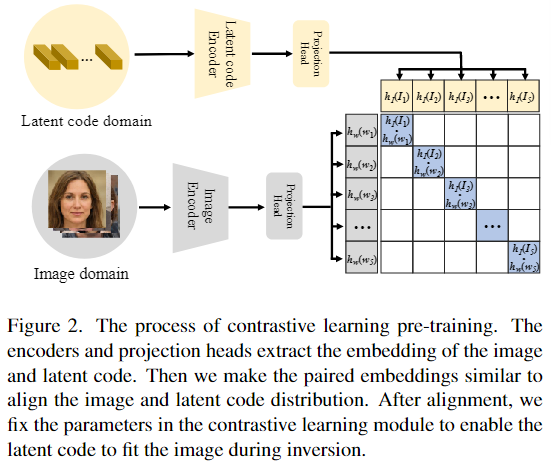
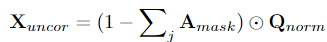

# Delving StyleGAN Inversion for Image Editing: A Foundation Latent Space Viewpoint

## Motivation

+ GAN Inversion的方法都忽视了最基础w空间，没能很好利用此空间更多的能力和信息

## Contribution

+ 受CLIP的启发，以对比学习的训练方式为每张图像找到一个更好的`w`向量，该空间通过对比学习与图像空间对齐
+ 用更好的`w`向量去引导`w+`和`f`生成，通过交叉注意力的方式

## Model

+ 
  + **Loss**：
    + 
    + 
+ 
  + **W+交叉注意力块**：w作为Q，粗残差w+作为K和V
    + 交叉关注可以使w+更接近w，从而保持极大的可编辑性。
    + 同时，由于我们通过Lalign得到了细化后的w，重构性能仍然可以被保留，所以损害太多w+的重构性能。
  + **F交叉注意力块**：T3最大的特征图作为Q，因为携带了最多的空间信息，w作为K和V
    + 用w来指导`f`的微调。
  + **Loss**：计算三个重建的损失，w、w+、(w+，f)
    + 
    + 
    + 
    + 

# StyleAlign: Analysis And Applications of Aligned StyleGAN Models

## Motivation

+ 之前的方法虽然简单的使用了对齐模型，但是并没有对对齐模型进行实质研究

## Contribution

+ 研究了微调后父模型和子模型之间的关系，然后使用它来解决各种任务

## Find

+ 在源域训练的StyleGAN在目标域微调
  + 对于距离近的域（人脸和卡通脸），微调似乎只影响到生成器的卷积层
  + 对于更远的域（比如人脸和狗脸），微调可能会影响到S空间
  + 对于极端远的域（比如人脸和教堂），则几乎没有关系了，但编辑人脸姿势的方向用在目标域仍然能起到编辑姿态的效果
  + PS：前两点意味着编辑属性的方向可以直接共用
+ 对于源域有、目标域没有的属性
  + 微调后的的属性并没有消失，而是隐藏了，因此再微调回源域，属性还会继续出现
  + 出现一些有趣的对应，比如人脸的头发长度，到了狗脸上就成了耳朵的长短
+ 对齐模型可以用在很多任务上
  + 图像翻译：用原图得到的反演LT，用在目标域的生成上，实现更好的翻译
  + zero-shot回归：用源域带标签的属性训练回归模型，在目标域图像上进行推理，文中用StyleGAN前4层到分类超平面的距离作为X，语义属性的程度为Y
  + zero-shot分类：可以用在人脸上训练的分类器对狗脸进行分类，只能对观察到的特定属性进行分类

# Masked and Adaptive Transformer for Exemplar Based Image Translation

## Motivation

+ 一些基于GAN的直接尝试控制全局风格的方法，忽略了空间相关性，无法忠实的重建细节信息
+ 跨域领域翻译，在输入图像与示例图像（希望复刻其风格的图像）之间建立跨域语义对应关系，再根据这种关系对示例图像进行扭曲以控制局部风格特征时，生成图像的质量很大程度上依赖于学习到的对应关系，然而精确的跨领域语义匹配具有挑战性，因此导致潜在的错误匹配对应关系会影响到生成图像的质量。
+ 一方面提高匹配的精度，另一方面降低匹配对应关系在生成中的作用

## Method

+ 
+ 可以这么理解，上面的一层提取一个更好的匹配对应关系，利用QKV能够更好的将示例图像的风格学习到输入图像的对应语义中，下面一部分用于控制总体的风格特征，它不依赖于匹配对应关系
+ 
+ Q、K、V是HW\*C，通过公式得到的A是HW\*HW，A代表的是查询图像的像素位置和示例图像各个像素位置的相似度，，softmax先把A中的值变成0-1的置信度，A\*V就把示例图像特征图中相似度最高的拥有最高的权重，得到可靠对应区域的特征值
+ 对于不可靠对应区域的特征：通过这个公式，两个卷积分别得到逐像素的调制权重和偏置参数，μ和δ分别是Q的均值和方差，再通过得到非匹配对应区域的翻译特征。由于γ和β是从输入图像xA中学习的，因此调制特征保留了xA的语义信息。**理想情况下，Xcor和Xuncor将相互补充，并促进图像生成中的语义一致性和风格相关性。**
+ Coord.Atten：对图像中的远程依赖关系进行建模
+ 
+ 
+ 
+ z可以通过对比学习来增强生成的风格质量：正样本-示例图像；负样本-早期生成的低质量图像

## Loss

+ 
+ 将不同域编码后的特征进行对齐
+ 
+ 因为训练数据中的示例图像是通过对输入图像对应的GT进行坐标扭曲得到的，因此对示例图像直接用A_mask进行坐标扭曲，那么理想情况下应得到GT
+ 
+ 高层语义损失：高层VGG19，代表高级语义特征
+ 
+ 上下文损失：w_l平衡VGG19不同中间层计算的结果
+ 
+ 对比风格损失
+ 
+ 生成图和GT通过HED算法提取的语义边界图的感知损失（结构损失)
+ 
+ 增加一个判别器计算判别损失，h约束判别结果不要超过1，也是一种从整体上约束生成图像风格属于域B的方式

# Towards Diverse and Faithful One-shot Adaption of Generative Adversarial Networks

## Motivation

+ 生成对抗网络虽然能生成高质量图像，但是需要大量数据去训练，因此在One-shot和Zero-shot领域极具挑战性
+ 语言能够很好的描述属性和风格，因此出现了很多基于CLIP的Few-shot的自适应方法，但CLIP通常是从全局风格进行考虑，忽略了详细的局部样式
+ 作者发现，参考图像和源图像之间是有共享属性和特定属性的分别，如果忽略两者差异直接进行特征对齐，会带来不必要的域共享属性的变化，不利于学习和继承预训练生成器的生成多样性

## Model

+ 

## Loss

+ 全局自适应损失：控制全局风格
+ 
+ 
+ 
+ 
+ 局部自适应损失（注意力风格损失attentive style loss）：控制局部风格
+ 
+ 选择性跨域一致性损失（selective cross-domain consistency loss）：控制生成多样性
+ 
+ 
+ α控制表示保留属性的比例，设`|∆wsαN |`为`|∆w|`的第α大元素，所有`∆w`中小于该值的才会被保留进行损失计算（对齐），大于的直接mask掉；且`∆w`是根据训练过程动态更新的——`∆w`：分别维护一个源域和目标域生成图像的反演LT队列，计算两队列聚类中心的距离，队列在训练中动态更新

# Cross-Modal Concept Learning and Inference for Vision-Language Models

