# Paint by Example: Exemplar-based Image Editing with Diffusion Models

## Motivation

+ 目前根据文本提示符指导下的图像编辑，纵使再详细的文本也会不可避免地引入歧义，可能无法精确的反应用户期望的效果
+ "a picture is worth a thousand words"，很多细力度的对象外观无法用语言指定，特别是对新手和非母语人士，这种情况很常见
+ 无法收集大量的（源图像、参考图像、编辑GT图像）的训练图像对，需要去设计一个自监督的训练方案

## Model

+ 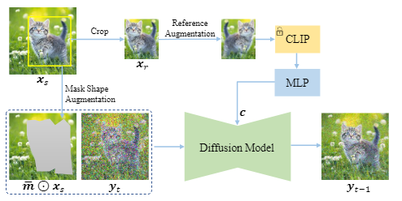
+ 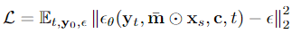

1. 使用预训练的Stable Diffusion Model作为初始化：避免模型简单记住参考图像
2. 使用参考图像增强：缩短训练集和测试集差距，因为训练过程中，参考图像是从源图像裁剪出来的，与测试场景严重不符
3. 使用掩码形状增强：基于边界框生成一个任意形状的蒙版用于训练，因为在推理时，我们希望可以随机画出不规则的编辑区域进行编辑，且掩码区域完整包括参考图像的对象，这在实际场景中过于严格
4. 使用information bottleneck，只使用CLIP得到的257个tokens中的表示类的那一个token作为条件，再经过一个MLP将参考图像压缩到一个长1024的一维向量：高度信息压缩能够保留语义信息的同时忽略的高频细节，迫使网络理解参考图像的内容，而不仅仅记住参考图像进行复制粘贴。防止网络简单学习这样的一个映射函数：`-m * x_s + x_r = xs`，因为训练时这里的`x_r = m * x_s`
5. 使用classifier-free guidance策略来控制编辑区域的结果与参考图像的相似度：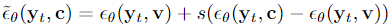，`v`表示可学习向量，`20%`的参考条件用`v`取代，`s`越大表示融合结果更依赖于条件参考输入。

## Experiment

+ 各个组件的消融

+ 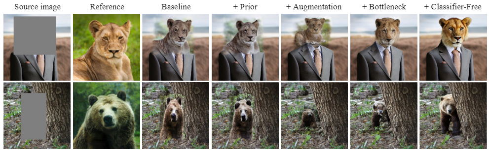
+ `s`的尺度的消融
+ 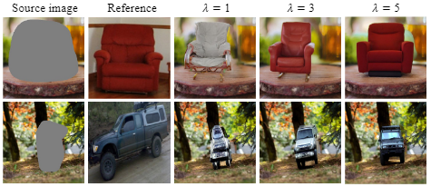
+ 编辑的定性实验
+ 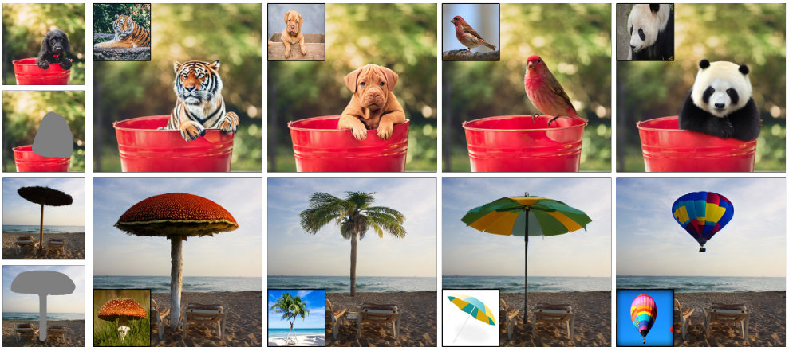

# An Edit Friendly DDPM Noise Space: Inversion and Manipulations

# DIFFUSION MODELS ALREADY HAVE A SEMANTIC LATENT SPACE

## code

+ ```python
  >> /HDD/liqiwang/Diffusion/Asyrp_official-main/runs/logs/ffhq_100_32_1000_100_1000/train.log 2>&1 &
  ```

# DiffusionCLIP: Text-Guided Diffusion Models for Robust Image Manipulation

## Motivation

+ GAN生成模型能力有限，基于GAN的反演方法对一些难图像（非结构图像）的反演和生成能力远不如Diffusion
+ 受限于GAN的表达能力，对于通用反演模型的设计很有挑战
+ 提出一个基于预训练Diffusion模型和CLIP损失优化的文本驱动编辑模型
  + 能够进行非常好的反演和文本引导编辑
  + 零样本进行unseen域的图像翻译
  + 简单的噪声图组合实现多属性同时编辑

## Model

+ 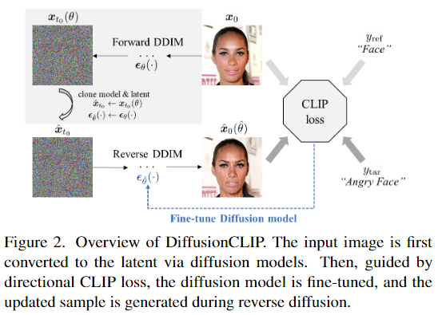

+ 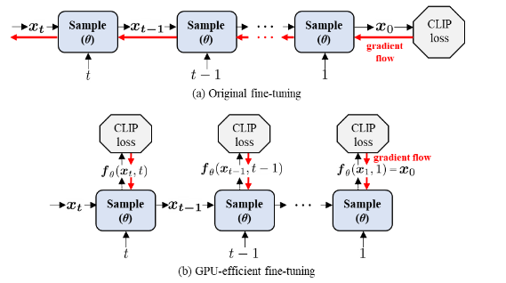

## Loss

+ CLIP方向损失，让生成图像的编辑变化方向与文本描述变化方向一致

+ 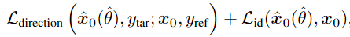
+ ID损失：
+ 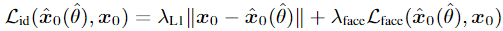

## Application

+ 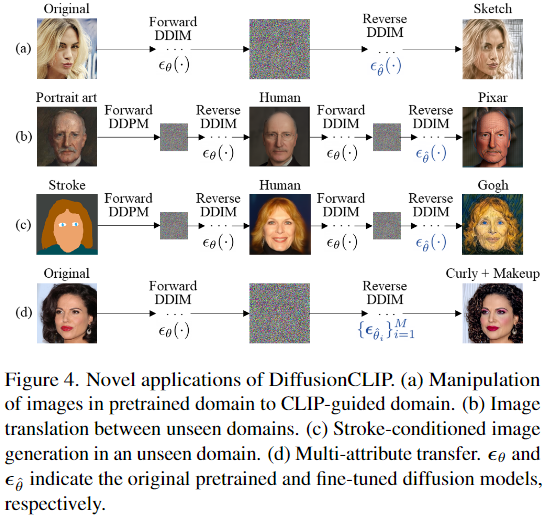
