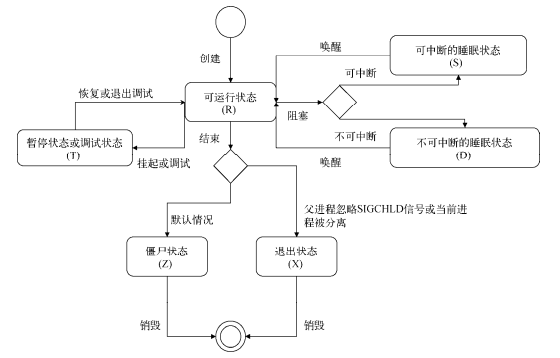
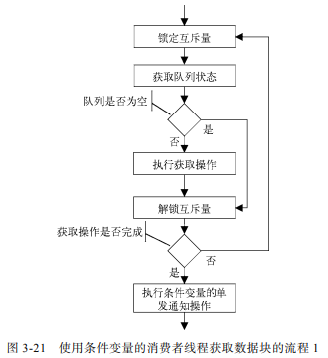
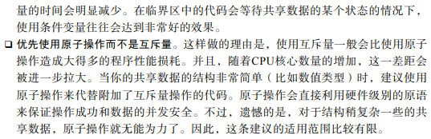

# 并发编程综述

## 并发程序和并行程序

+ 并发程序指的是可以被同时发起执行的程序
+ 并行程序指被设计成可以在并行的硬件上执行的并发程序。
+ 并发程序代表了所有可以实现**并发行为**的程序，比较宽泛，包含了并行程序
+ 并发运行是指多个任务几乎被同时发起（或者说开始）运行，但是在同一时刻这些任务不一定都处于运行状态（这取决于 CPU 核心或者 CPU 的数量）。相比之下，并行运行指的是在同一时刻可以有多个任务真正地同时运行。 并行运行的必要条件是多 CPU 核心或多 CPU 的计算环境。因此，并行运行可以看作并发运行的一个更高级的层次，或者说，并行运行的一个必要条件就是并发运行。

## 串行程序与并发程序

+ 串行程序特指只能被顺序执行的指令列表，并发程序则是可以被并发执行的两个及以上的串行程序的综合体
+ 串行程序并发的基础
  + 多元程序：由操作系统内核支持，并提供多个串行程序复用多个CPU的方法
  + 多元处理：计算机中多个CPU共用一个存储器（内存），并且在同一时刻可能会有数个串行程序分别运行在不同的CPU之上

## 并发系统

+ 也叫**分布式系统**
+ 程序与程序之间可以通过协商一致的协议进行通信，并且它们之间是松耦合的。它们可以看作一个系统
+ 并发系统更有可能是并行的，因为其中的多个程序一般可以同时在不同的硬件环境上运行

并发程序具有不确定性

## 进程间的通信（IPC：Inter-Process Communication）

### 基于通信的IPC方法

1. 数据传送
   1. 管道（pipe），用来传送字节流
   2. 消息队列（message queue），用来传送结构化的消息对象
2. 共享内存，共享内存区（shared memory），是最快的一种IPC方法

### 基于信号的IPC方法

+ 操作系统的信号（signal）机制，也是唯一一种异步IPC方法

### 基于同步的IPC方法

+ 信号量（semaphore）

### GO支持的IPC方法

+ 管道、信号、socket

## 进程

### 概念

+ 把一个程序的执行称为一个进程，进程用于描述程序的执行过程
+ 程序和进程是一对概念，分别描述了一个程序的静态形式和动态特征
+ 进程还是操作系统进行资源分配的基本单位

### 衍生

+ 进程使用fork（一个系统调用函数）创建若干新的子进程，每个子进程都是源自它的父进程的一个副本，它会获得父进程的数据段、堆和栈的副本，并与父进程共享代码段。每一份**副本都是独立的**， 子进程对属于它的副本的修改对其父进程和兄弟进程（同父进程）都是**不可见**的，反之亦然。

+ Unix/Linux 操作系统中的每一个进程都有父进程。所有的进程共同组成了一个树状结构。内核启动进程（PID为1）作为进程树的根，负责系统的初始化操作，它是所有进程的祖先，它的父进程就是它自己。如果某一个进程先于它的子进程结束，那么这些子进程将会被 内核启动进程“收养”，成为它的直接子进程。

### 进程的状态

+ 
+ 

### 进程的状态转换

+ 

### 进程的空间

+ 用户进程会生存在用户空间中，不能与计算机硬件进行交互
+ 内核可以与硬件交互，生存在内核空间中
+ 用户空间和内核空间都是操作系统在内存上划分出的一个范围，它们共同瓜分了操作系统能够支配的内存区域

### 虚拟内存与地址

+ 内存地址
  + 内存区域中的每一个单元都是有地址的，这些地址由指针来标识和定位。

+ 这里所说的地址并非物理内存中的真实地址，而是**虚拟地址**。而由虚拟地址来标识的内存区域又称为**虚拟地址空间**，有时也称为虚拟内存。
+ 虚拟内存的最大容量与实际可用的物理内存的大小无关。内核和 CPU 会负责维护虚拟内存与物理内存之间的映射关系。
+ 内核会为每个用户进程分配的是虚拟内存而不是物理内存。每个用户进程分配到的虚拟内存总是在用户空间中，而内核空间则留给内核专用。
+ 进程的虚拟内存几乎是彼此独立、互不干扰的，这是由于它们基本上被映射到了不同的物理内存之上。
+ <u>内核会把进程的虚拟内存划分为若干页（page），而物理内存单元的划分由 CPU 负责。一个物理内存单元被称为一个页框（page frame）。不同进程的大多数页都会与不同 的页框相对应</u>：
  + 

### 系统调用

+ 为了使用户进程能够使用操作系统更底层的功能，内核会暴露出 一些接口以供它们使用，这些接口是用户进程使用内核功能（包括操纵计算机硬件）的 唯一手段，也是用户空间和内核空间之间的一座桥梁。**用户进程使用这些接口的行为称为系统调用**，不过在很多时候“系统调用”这个词也指内核提供的这些接口。
+ 
+ 系统调用是内核的一部分，会导致内核空间中数据的存取和指令的执行，而普通函数只能在用户空间中有所作为

## 同步

### 原子操作和临界区

+ 执行过程中不能中断的操作称为原子操作（atomic operation），而只能被串行化访问或执行的**某个资源**或**某段代码**称为临界区（critical section）。
+ 原子操作和临界区这两个概念看起来有些相似。但是，原子操作是不能中断的，而临界区对是否可以被中断却没有强制的规定，只要保证一个访问者在临界区 中时其他访问者不会被放进来就可以了。这也意味着它们的**强度是不同的**。
+ 原子操作必须由一个单一的汇编指令表示，并且需要得到芯片级别的支持，是绝对并发安全的
+ 相比原子操作，让串行化执行的若干代码形成临界区的这种做法更加通用。保证只有一个进程或线程在临界区之内的做法有一个官方称谓——互斥（mutual exclusion，简称 mutex）

## 管道

+ 管道（pipe）是一种半双工（单向）的通信方式
+ 只能用于父进程和子进程；同祖先的子进程之间的通信
+ 优点是简单，缺点是只能单向通信且对通信双方关系的严格限制
+ code

## 信号

+ IPC中唯一一种异步通心方法，本质是用软件来模拟硬件的中断机制。信号用来通知某个进程有某个事件发生了。
+ 

### 信号的来源

+ 键盘输入
+ 硬件故障
+ 系统函数调用
+ 软件中的非法运算

### 进程响应信号的方式

+ 忽略
+ 捕捉
+ 执行默认操作
  + 终止进程
  + 忽略该信号
  + 终止进程并保存内存信息
  + 停止进程
  + 恢复进程（若进程已停止）

### code

## Socket

+ 译为套接字，可以通过网络连接让多个进程建立通信并相互传递数据`->`使通信端的位置透明化，因为通信双方不需要在同一台计算机上

### code

## 多线程编程

+ POSIX（Portable Operating System Interface of Unix），中文可以翻译为 Unix 可移植性操作系统接口，为了提高各种类 Unix 操作系统下应用程序的可移植性而开发的一套规范。在 Unix 世界中，POSIX 标准中定义的线程及操作方法已经被广泛认可和遵循。Linux 系统提供了以 POSIX 标准中定义的线程 （以下简称 POSIX 线程）为中心的各种系统调用。在 Linux 系统中，最贴近 POSIX 线程标准的线程实现称为 NPTL（Native POSIX Threads Library）。从 Linux 系统内核的 2.6 版本开始，NPTL 已经逐渐成为其默认的线程实现。
+ POSIX线程是Go并发编程模型在Linux系统下真正使用的内核接口，Go 并发编程模型在底层是由操作系统所提供的线程库支撑的。

### 线程

+ 

### 线程的标识

+ TID

### 线程的控制

+ 同一进程内线程是平级的，一个线程控制和管理其它线程方法：

  + 创建线程：`pthread_create`

  + 终止线程：`pthread_cancel`

  + 连接已终止的线程：`pthread_join`

  + 分离线程：`pthread_detach`

+ 一个线程对自身的控制：

  + 终止：
    + 线程执行的函数执行了`return`语句
    + 执行系统调用`exit`函数
    + 执行系统调用`pthread_exit`函数，与前两者不同，前两者主线程执行，那么当前进程中所有线程都会终止，这里其他线程仍会照常运行
  + 分离：与分离其它线程一致，只是传给系统调用函数`pthread_detach`的线程的ID是自己的ID

### 线程的状态

+ 

### 线程的调度

+ 操作系统内核的调度器就是使用若干策略对众多线程在CPU上的运行进行干涉，以使得操作系统中的各个任务都能够有条不紊地运行，同时还要兼顾效率和公平性。
+ 从线程的角度看，调度器是通过协调各个线程的状态来达到调度的目的。

### 线程实现模型

+ 用户级线程模型、内核级线程模型、两级线程模型
+ 
+ Go的并发编程模型与两级线程模型在理念上非常相似，不过具体的实现方式更加高级和优雅。在Go的并发编程模型中，不受操作系统内核管理的独立控制流并不叫做应用程序线程或者线程，而称为goroutine（Go例程）

## 线程同步

+ 在多个线程之间采取同步措施，无非是为了让它们更好地协同工作或者维持共享数据的一致性。以后者作为目的的同步较为常见，但在以前者作为控制流管理手段的程序中同步的意义更大。而在实际的场景中，同步的目的则更可能是两者兼而有之。

### 共享数据的一致性

+ 包含多个线程的程序（以下简称多线程程序）多以共享数据作为线程之间传递数据 的手段。由于一个进程所拥有的相当一部分虚拟内存地址都可以被该进程中的所有线程共享，所以这些共享数据大多是以内存空间作为载体的。
+ 如果操作共享数据的实际结果总是与我 们约定的（或者说期望的）操作结果相符，就可以说该共享数据的一致性得到了保证。
+ 共享数据的一致性保证则是多线程程序中的各个控制流得以正确执行的前提。
+ 我们需要通过额外的手段来**保证**被多个线程**共享的变量的一致性**，这才**有了临界区**这个概念。

### 临界区

+ 临界区是只能被串行化访问或执行的某个资源或某段代码，因而也常称为串行区域。
+ 保证临界区有效的最佳方式就是**利用同步机制**：包括原子操作、**互斥量**、**条件变量**等同步方法。
+ 我们通常把操作同一个共享数据的代码都置于一个或多个临界区之内，并使用同一个互斥量对它们进行保护。

### 互斥量

+ 同一时刻，只允许一个线程处于临界区之内的约束称为互斥（mutex）。
+ 每个线程在进入临界区之前，都必须**先锁定某个对象**，只有成功锁定对象的线程才会被允许进入临界区，否则就会阻塞，这个对象称为互斥对象或**互斥量**。
+ 互斥量简单而高效，并且适用于共享数据的绝大部分同步场景。互斥量的实现会用到机器语言级别的原子操作，并仅在锁定冲突时才会涉及系统调用的执行。这使得互斥量比其他同步方法（比如信号量）的速度要快很多。

#### 设计原则

+ 一般情况下，我们要尽量少地使用互斥量，每个互斥量保护的临界区应该在合理范围内并尽量大。
+ 切分之后由不同的互斥量保护的临界区中包含了对同一个共享资源的同一种操作，那么此次临界区切分就是不成功的。因为这种不对应的关系会使互斥量的所谓保护失去意义。即使只是包含了对同一个共享资源的不同操作，也应该仔细考虑，怎样保证这些不同的操作在被同时执行时不会给共享资源或程序正常流程造成破坏。
+ 尽量不要让不同的互斥量所保护的临界区重叠。因为这会大大增加死锁发生的几率。

#### 死锁的解决办法

+ “试锁定-回退”：
+ “固定顺序锁定”：它的思路是在需要先后对多个互斥量进行锁定的场景下，总以固定不变的顺序锁定它们。互斥量 1 和互斥量 2 的解锁操作的顺序与其锁定操作的顺序之间没有强制性的约束，这取决于具体的流程设计。但在一般情况下，解锁操作的顺序与其锁定操作的顺序相反。这是因为往往需要保证在一个线程完全离开这些重叠的临界区之前，不会有其他同样需要锁定那些互斥量的线程进入到那里。
+ **优缺点**：第一种方法虽然更加通用但却会使程序更加复杂，而第二种方法既简单又实用，但是它却因固定的操作顺序而降低了程序的灵活性。
+ **死锁预防**：保持共享数据的独立性（同一时间只可能有一个线程对共享数据进行访问）是预防因使用互斥量而导致死锁的最佳方法。如果共享数据之间的关联无法消除，那么尽可能使多个临界区之间没有重叠。仅当这两点都无法得到保证时，才考虑使用“试锁定-回退” 和“固定顺序锁定”的方法。

### 条件变量

+ 在对应的共享数据的状态发生变化时，通知其它因此而被阻塞的线程
+ 条件变量总是与互斥量组合使用，条件变量在真正使用之前，还必须要与某个互斥量进行绑定
+ 使用条件变量前，同样必须创建和初始化，而且初始化也必须要保证唯一性

#### 操作

+ 等待通知：阻塞当前线程，直到收到该条件变量发来的通知。包含以下两个共同形成的原子操作。
  + 解锁相应的互斥量
  + 阻塞当前线程
  + 当等待通知操作因收到条件变量发送的通知而唤醒当前线程后，会首先重新锁定与该条件变量绑定在一起的那个互斥量。如果该互斥量已经被其他线程抢先锁定，那么当前线程会再次进入睡眠状态。
  + 
+ 单发通知
  + 让该条件变量向至少一个正在等待它通知的线程发送通知，以表示某个共享数据的状态已经改变。
  + 消费者线程通知：
  + 
  + **条件变量的通知具有即时性。**通知只是负责向等待线程发送一个信号以告知共享数据的状态发生了某种变化，而不会存储相关信息。在通知被发送的时候， 如果没有任何线程正在等待此条件变量的通知，那么该通知就会被直接丢弃，并且也绝不会传递到之后才开始等待它的线程那里。
+ 广播通知
  + 让条件变量给正在等待它通知的所有线程发送通知，以表示某个共享数据的状态已经改变。

#### 单/广应用场景的区别

+ 如果一个等待线程接收到通知但未能及时作出响应，那么这个通知就属于**过剩通知**，这种情况下，因接收到通知而唤醒等待线程的这个动作也称为**伪唤醒**。
+ 如果明知道等待线程都在等待**共享数据的同一个状态**，并且在某个等待线程被唤醒并执行相应操作之后，共享数据的状态就不再满足等待线程的条件了，那么再使用广播通知操作来通知等待线程肯定是低效的。
+ 如果多个等待同一个条件变量通知的线程所期望的**共享数据状态存在多样性**，那么以广播的方式发送通知就是最好的选择。准备发送通知的线程（以 下简称发送线程）无法得知在执行单发通知操作之后哪个线程会接收到该通知，因此它只能执行广播通知操作向所有的等待线程告知共享数据的状态已发生变化，并且不会（也不可能）关心哪些等待线程会对这一状态变化感兴趣。

+ 互斥量可以实现对临界区的保护，并会阻止竞态条件的发生。条件变量作为补充手段，可以让多方协作更有效率。

## 线程安全

+ 可重入：让函数具有线程安全最有效方式。如果多个线程并发地调用该函数，与它们以任意顺序依次调用它所产生的效果总是相同的，那么该函数就是一个可重入函数。
+ 在还未深入考虑过或者还没有最终确定使用哪一种方式保证线程安全性的时候，请使用互斥量保护好那些涉及共享数据操作（包括访问和更新）的代码。

## 线程调优

+ 现在软件开发者的一个主要任务就是让程序更加高效地并发运行。这里的高效是指，在保证程序**正确性**和**可伸缩性**的前提下提升程序的**响应时间**和**吞吐量**。
  + 响应时间：响应时间是指从计算请求提交 到计算结果可用之间的实际耗时。对于一个长期运行的程序（比如各种服务端程序）来 说，响应时间是非常重要的性能指标。
  + 吞吐量：是指在一个时间单元（比如秒或分钟）之内程序完成并输出结果的计算任务的数量。采用多进程或多线程编程是可以让此指标提升的主要方法。不过，这也取决于实际运行程序的计算机硬件的性能（比如 CPU 的时钟频率和核心数量）。
  + 正确性：是指程序的行为应该与程序设计者的意图严格一致，即使在它并发运行的时候也应该如此。
  + 可伸缩性：可伸缩性主要体现在增加 CPU 核心数量的情况下，其运行速度不会受到负面影响。并发程序运行速度的提升曲线会随着 CPU 核心数量的增加而趋于平缓。这种趋于平缓的态势主要取决于并发程序中使用的同步方法的数量和执行耗时。对于同一个程序来说，其中同步方法的数量越多、执行耗时越长，其运行速度的提升曲线趋于平缓的态势就越明显。

### 为什么需要提高程序的可伸缩性

+ 相比于通过优化程序的方式提升 其运行性能来说，为运行它的计算机添加更多的 CPU 核心（或者更换一台拥有更多 CPU 核心的计算机）往往会更加直接、简单，甚至廉价。

### 在不失去程序正确性的前提下最大限度地提高程序的可伸缩性（方法）

+ 
+ 

# Go的并发机制

+ Go搭建了一个特有的两级线程模型：`goroutine`，Go不推荐用共享内存的方式来传递数据，而推荐使用`channel`（通道）
+ 含义：不要用共享内存的方式来通信，而应该以通信作为手段来共享内存
+ Go的并机制是指用于支撑`goroutine`和`channel`的底层原理

## 线程实现模型

+ Go运行时系统会对这些实体的实例进行实时管理和调度。

+ 
+ 
+ 
+ **M与KSE** 之间总是一对一的关系，一个 M 能且仅能代表一个内核线程。Go 的运行时系统（runtime system）用 M 代表一个内核调度实体。M 与 KSE 之间的关联非常稳固，一个 M 在其生命周期内，**会且仅会与一个 KSE 产生关联**。
+ **M 与 P**、 **P 与 G** 之间的关联都是易变的，它们之间的关系会在实际调度的过程中改变。
  + M与P总是一对一的
  + P与G则是一对多的（P中包含一个可运行的G的队列）
+ **M 与 G** 之间也会建立关联，因为一个 G 终归会由一个 M 来负责运行；它们之间的关联会由 P 来牵线。
+ 

## 调度器

+ Go 调度器并不是运行在某个专用内核线程中的程序，调度程序会运行在若干已存在的 M（或者说内核线程）之中。换句话说，运行时系统中几乎所有的 M 都会参与调度任务的执行，它们共同实现了 Go 调度器的调度功能。
+ 

### 字段

+ 

### 启用和停止M

+ 

### 系统检测程序

+ 系统监测程序是在 Go 程序启动之初由一个专用的 M 运行的， 并且它运行在系统栈之上。

## 垃圾回收（GC）

### code

+ 查看 runtime 包中的 gcStart 等函数，也可以从 sysmon 函数中的强制 GC 和清扫堆相关代码看起。

## Goroutine

+ Go语言特有的关键字go，是用户程序启动goroutine的唯一途径

## Channel

### 定义

+ ```go
  // 双向 T表示可以经由此通道传递的元素值的类型
  chan T
  // 发送通道类型
  chan<- T
  // 接收通道类型
  <-chan T
  
  // 初始化,通道也是引用类型,需要用make初始化
  make(chan int, 10)  // 缓冲容量10的缓冲通道，缓冲容量总是固定不变的
  make(chan int, 0) make(chan int)  // 非缓冲通道
  
  // 有一点需要特别注意：试图从一个未被初始化的通道值（即值为 nil 的通道）那里接收元素值，会造成当前 goroutine 的永久阻塞！
  ```

### 接收元素值

+ ```go
  strChan := make(chan string, 3)
  elem := <-strChan
  // 1. <-右边也可以是返回通道类型的通道表达式
  // 2. 也可以写成 
  elem, ok := <-strChan
  // 如果在进行接收操作之前或过程当中该通道被关闭了，那么该操作会立即结束，并且变量 elem 会被赋予该通道类型的元素类型的零值。因此 ok 用来判断该零值是因为通道关闭（false）还是发送方发送（true）
  
  ```


### 发送元素值

+ 发送方向通道发送的值会被复制，但是浅复制，因此字典、切片等引用类型的修改会同时影响到收发双方持有的值
  + 不过有时候传递的值得类型不能简单地判定为值类型还是引用类型，需要格外注意检查对他们的修改的影响是否符合预期
+ 传递的值至少被复制依次，最多被复制两次
  + 例如， 当向一个已空的通道发送值，且已有至少一个接收方因此等待时，该通道会绕过本身的缓冲队列，直接把这个值复制给最早等待的那个接收方。又例如，当从一个已满的通道 接收值，且已有至少一个发送方因此等待时，该通道会把缓冲队列中最早进入的那个值 复制给接收方，再把最早等待的发送方要发送的数据复制到那个值的原先位置上。通道的缓冲队列属于环形队列，所以这样做是没问题的。这种情况下，涉及的那两个值在传递到接收方之前都会被复制两次。
+ 与接收操作类似，**向一个值为nil的通道类型的变量发送元素值时**，当前goroutine会被永久阻塞
+ **向一个已关闭的通道发送元素值**，那么会立即引发一个运行时恐慌，即使发送操作正在因通道已满而被阻塞

### 关闭通道

+ 在发送端关闭通道一般不会对接收端的接收操作产生什么影响，接收方仍然会正常接收完通道中的元素值
+ 无论怎样都不应该在接收端关闭通道。因为在接收端通常无法判断发送端是否还会向该通道发送元素值。

### 接发顺序

+ 

### 长度与容量

+ 内建函数 **len** 和 **cap** 也是可以作用在通道之上的，它们的作用分别是获取通道中当前的元素值数量（即**长度**）和通道可容纳元素值的最大数量（即**容量**）。通道的**容量是在初始化时已经确定的，并且之后不能改变**，而通道的**长度则会随着实际情况变化**。

## 单向通道

+ 单向通道通过具体的关键字，通常出现在接口类型或函数和结构体方法中，不能直接出现在变量声明中
+ 单向通道可以由双向通道转换而来（**利用函数声明**），是Go语言语法糖的一种体现，但是利用函数声明把单向通道转换成双向通道时，会得到一个编译错误
+ 通道传递方向的不同也意味着**它们的类型不同**，因此不能通过断言等方式进行转换

## for与channel

+ ```go
  var ch chan int
  
  for e := range ch {
  	fmt.Printf("Element: %v\n", e)
  }
  ```

+ for 语句会不断地尝试从通道中接收元素值，直到该通道关闭。在通道关闭时，如果通道中已无元素值，那么这条 for 语句的执行就会立即结束。而当此时的通道中还有遗留的元素值时，for 语句仍可以继续把它们取完。这与普通的接收操作行为一致。
+ 从一个还**未被初始化的通道**中接收元素值会导致当前 goroutine 的**永久阻塞**， 使用 for 语句时也不例外。
+ 当通道中**没有任何元素值时**，**for 语句所在的 goroutine 也会陷入阻塞**，阻塞的具体位置会在其中的 range 子语句处。

## select与channel

+ select 语句是一种仅能用于通道发送和接收操作的专用语句。一条 select 语句执行时，会选择其中的某一个分支并执行。

+ ```go
  var intChan = make(chan int, 10) 
  var strChan = make(chan string, 10) 
  
  select { 
  case e1 := <-intChan: 
   fmt.Printf("The 1th case was selected. e1=%v.\n", e1) 
  case e2 := <-strChan: 
   fmt.Printf("The 2nd case was selected. e2=%v.\n", e2) 
  default: 
   fmt.Println("Default!") 
  } 
  ```

+ 分支选择规则：在开始执行 select 语句的时候，所有跟在 case 关键字右边的发送语句或接收语句中的通道表达式和元素表达式都会先求值（求值的顺序是从左到右、自上而下的），无论它们所在的 case 是否有可能被选择都会是这样。
+ select必须选中一个case（运行时系统会执行该case及其包含的语句），而忽略其它case，否则select将阻塞，直到有case能够立即进行（指当前 goroutine 不会因此操作而被阻塞）。当多个case满足条件时，会通过一个伪随机算法选择一个case运行。

## select+for

+ ```go
  package main
  
  import "fmt"
  
  func main() {
  	intChan := make(chan int, 10)
  	for i := 0; i < 10; i++ {
  		intChan <- i
  	}
  	close(intChan)
  	sync := make(chan struct{}, 1)
  	go func() {
  	Loop:
  		for {
  			select {
  			case e, ok := <-intChan:
  				if !ok {
  					fmt.Println("End.")
                        // 这是一条带标签的 break 语句，Loop 为标签的名字，意为中断紧贴于该标签之下的那条语句的执行。
                        // break Loop 和 Loop: 必须是遥相呼应的，前者必须包含在后者下方紧邻的那条语句中。
  					break Loop
  				}
  				fmt.Printf("Received: %v\n", e)
  			}
  		}
  		sync <- struct{}{}
  	}()
  	<-sync
  }
  ```


## 非缓冲channel

+ 在初始化一个通道时将其容量设置成 0，或者直接忽略对容量的设置，就会使该通道成为一个非缓冲通道。与以异步的方式传递元素值的缓冲通道不同，非缓冲通道只能**同步**地传递元素值。
+ 由于非缓冲通道会以同步的方式传递元素值，在其上收发元素值的速度总是与慢的那一方持平。

### 接发顺序

+ 

## time包与channel

+ Go 语言的标准库代码包 time 中的一些 API 是用通道辅助实现的，这些 API 可以帮助我们对通道的收发操作进行更有效的控制。

### 定时器

+ `time.NewTimer`

+ ```go
  var timer *time.Timer = time.NewTimer(3*time.Hour + 36*time.Minute)
  ```

+ timer 是*time.Timer 类型的，而不是 time. Timer 类型的。前者的方法集合包含了两个方法：Reset 和 Stop。Reset 方法用于重置定时器（也就是说，定时器是可以复用的），该方法会返回一个 bool 类型的值。Stop 方法用于停止定时器，也会返回一个 bool 类型的值作为结果。它们的结果值有着相同的含义：如果值为 false，就说明该定时器早已到期（或者说已经过期）或者已被停止，否则就说明该定时器刚刚由于方法的调用而被停止。
  + 定时器到期之前停止了它，那么就不要从该定时器的字段C接受元素了，因为它没有机会缓冲任何值了，这会导致当前goroutine永远阻塞
  + 复用定时器，应确保旧的同时已经被回收，否则新的会被丢弃
+ `time.AfterFunc`
  + 它是另一种新建定时器的方法，接受两个参数，第一个参数代表相对到期时间，第二个参数指定到期时需要执行的函数。time.AfterFunc 函数同样会返回新建的定时器。不过，这样的定时器在到期时，并不会向它的通知通道发送元素值，取而代之的是新启用一个 goroutine 执行调用方传入的函数。无论它是否被重置以及被重置多少次都会是这样

+ ```go
  // 使用定时器，我们可以便捷地实现对接受操作的超时设定
  // 在 time.Timer 类型中，对外通知定时器到期的途径就是通道，由字段 C 代表。一旦触及到期时间，定时器就会向它发送一个元素值。这个元素值代表了该定时器的绝对到期时间。
  package main
  
  import (
  	"fmt"
  	"time"
  )
  
  func main() {
  	intChan := make(chan int, 1)
  	go func() {
  		time.Sleep(time.Second)
  		intChan <- 1
  	}()
  	select {
  	case e := <-intChan:
  		fmt.Printf("Received: %v\n", e)
  	case <-time.NewTimer(time.Millisecond * 500).C: // time.After(time.Millisecond * 500)
  		fmt.Println("Timeout!")
  	}
  }
  ```

### 断续器

+ time 包中另一个重要的结构体类型是 time.Ticker。它表示了断续器的静态结构，包含的字段与 time.Timer 一致，但行为却大不相同。定时器在重置之前只会到期一次，而**断续器则会在到期后立即进入下一个周期并等待再次到期，周而复始，直到被停止**。

+ ```go
  var ticker *time.Ticker = time.NewTicker(time.Second)
  ```

## 载荷发生器

+ 可以作为软件测评的辅助工具，可以向被测软件发送指定量的载荷，并记录下被测软件处理载荷的结果
+ 为什么通道类型用结构体的指针类型而不是原类型：**元素值的零值判断带来麻烦**。我使用它的指针类型作为通道的元素类型，既可以消除麻烦，也可以**减少元素值复制带来的开销**。
+ 核心功能：
  + 控制、协调载荷的生成和发送
  + 响应的接收和验证
  + 最终结果的递交

# 同步

## 互斥锁

+ `sync.Mutex`

## 读写锁

+ `sync.RWMutex`：可以分别针对读操作和写操作进行锁定和解锁操作
+ 写锁定和写解锁：`Lock()/Unlock()`
+ 读锁定和读解锁：`RLock()/RUlock()`
+ 读写互斥关系：
  + 多个写操作之间都是互斥的
  + 写操作与读操作之间也都是互斥的
  + 多个读操作之间却不存在互斥关系
+ 阻塞关系
  + **写解锁**会试图唤醒**所有**因欲进行**读锁定**而被阻塞的 goroutine
  + **读解锁**只会在**已无任何读锁定**的情况下，试图唤醒**一个**因欲进行**写锁定**而被阻塞的 goroutine
  + 对未锁定的读写锁进行解锁，都会引起一个**不可恢复**的运行时恐慌

## 条件变量

+ `*sync.Cond`，但需要初始化`sync.NewCond(l Locker) *Cond`
+ 操作方法
  + `Wait()`：会自动地对与该条件变量关联的那个锁进行解锁，并且使它所在的goroutine 阻塞。一旦接收到通知，该方法所在的 goroutine 就会被唤醒，并且该方法会立即尝试锁定该锁。
  + `Signal()`：方法 Signal 和 Broadcast 的作用都是发送通知，以唤醒正在为此阻塞的goroutine。前者的目标只有一个，而后者的目标则是所有。
  + `Broadcast()`：方法 Signal 和 Broadcast 的作用都是发送通知，以唤醒正在为此阻塞的goroutine。前者的目标只有一个，而后者的目标则是所有。

## 原子操作

+ 由标准库代码包`sync/atomic`中的各种函数对6种简单类型的值执行5种原子操作
  + 值：`int32、int64、uint32、uint64、uintptr、unsafe.Pointer`
  + 操作：增/减、比较并交换、载入、存储、交换
+ **对于不能被取址的数值是无法进行原子操作的**

### 增/减少

+ 被操作值的类型只能是数值类型，即：`int32、int64、uint32、uint64、uintptr`类型

+ `Add+类型`

+ ```go
  // 例如AddUint32
  newi32 := atomic.AddInt32(&i32, 3) // 原子地把一个 int32 类型的变量 i32 的值增大 3，减少3即加-3
  // 特殊情况：对无符号类型uint32/uint64进行减操作
  atomic.AddUint32(&ui32, ^uint32(-NN-1))  // 原子地对应类型的变量增加 NN（NN 代表了一个负整数）
  atomic.AddUint64(&ui64, ^uint64(-NN-1))  // 原子地对应类型的变量增加 NN（NN 代表了一个负整数）
  ```

### 比较并交换

+ `CompareAndSwap+类型`
+ `func CompareAndSwapInt32(addr *int32, old, new int32) (swapped bool) `

### 载入

+ 原子的读取操作
+ `Load+类型`
+ `v := atomic.LoadInt32(&value) `

### 存储

+ 原子的写入操作
+ `Store+类型`
+ `atomic.StoreInt32(addr *int32, value int32)`

### 交换

+ 也是原子的写入操作，只是会返回旧值
+ `Swap+类型`
+ `old := atomic.SwapInt32(addr *int32, new int32)`

## 原子值

+ `var atomicVal atomic.Value`

+ `sync/atomic.Value`类型的变量一旦声明，其值就不应该被复制到它处，包括赋给别的变量、作为参数值传入函数，作为结果值从函数返回、作为元素值通过通道传递等都会造成值的复制。不过，`sync/atomic.Value`类型的指针类型的变量却不存在这个问题。

  + 根本原因是，对结构体值的复制不但会生成该值的副本，还会生成其中字段的副本。如此一来，本应施加于此的并发安全保护也就失效了。甚至，向副本存储值的操作都已与原值无关了。

+ 方法

  + `Load()`：原子地读取原子值实例中存储的值，它会返回一个interface{}类型的结果且不接受任何参数，未存储前返回nil
  + `Store()`：原子地在原子值实例中存储一个值，它接受一个interface{}类型的参数而没有任何结果

+ COW(Copy-On-Write)，写时复制操作：当要修改值时生成并修改副本，然后再用副本替换原值，是一种无锁化变成方案，借鉴了读写分离思想

  + ```go
    type intArray struct {
    	length uint32
    	val    atomic.Value
    }
    newArray := make([]int, array.length)
    copy(newArray, array.val.Load().([]int))
    newArray[index] = elem
    array.val.Store(newArray)
    
    // 不要这样做！否则会形成竞态条件！
    // 因为切片类型属于引用类型，复制并不会复制底层数组，当多个并发调用的函数读取或修改同一个切片值，必然会产生竞态条件
    // oldArray := array.val.Load().([]int)
    // oldArray[index] = elem
    // array.val.Store(oldArray)
    ```

    
