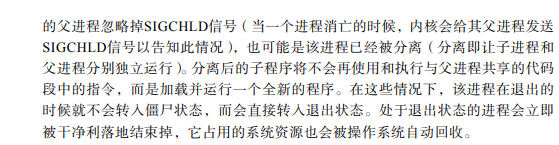

# 并发和并行的区别

+ **并发**：逻辑上具备同时处理多个任务的能力
+ **并行**：物理上在同一时刻执行多个并发任务

# sync包提供的两种锁类型

+ **互斥锁**：`sync.Mutex`是最简单的一种锁类型，当一个协程获得了Mutex（调用`Lock()`方法）后，其他协程只能等到这个协程释放该Mutex（调用`Unlock()`方法）后才能进行资源抢占。
+ **读写锁**：`sync.RWMutex`性能上较`sync.Mutex`而言要高一些，适用于单写多读的应用场景。在读锁占用的情况下会组织写，但不阻止读。也就是多个协程可同时获取读锁（调用`RLock()`方法）。而写锁（调用`Lock()`方法）会阻止其他任何协程（无论读和写）抢占资源，相当于由该协程独占该资源。

# 并发编程综述

## 并发程序和并行程序

+ 并发程序指的是可以被同时发起执行的程序
+ 并行程序指被设计成可以在并行的硬件上执行的并发程序。
+ 并发程序代表了所有可以实现**并发行为**的程序，比较宽泛，包含了并行程序

## 串行程序与并发程序

+ 串行程序特指只能被顺序执行的指令列表，并发程序则是可以被并发执行的两个及以上的串行程序的综合体
+ 串行程序并发的基础
  + 多元程序：由操作系统内核支持，并提供多个串行程序复用多个CPU的方法
  + 多元处理：计算机中多个CPU共用一个存储器（内存），并且在同一时刻可能会有数个串行程序分别运行在不同的CPU之上

## 并发系统

+ 也叫**分布式系统**
+ 程序与程序之间可以通过协商一致的协议进行通信，并且它们之间是松耦合的。它们可以看作一个系统
+ 并发系统更有可能是并行的，因为其中的多个程序一般可以同时在不同的硬件环境上运行

并发程序具有不确定性

## 进程间的通信（IPC：Inter-Process Communication）

### 基于通信的IPC方法

1. 数据传送
   1. 管道（pipe），用来传送字节流
   2. 消息队列（message queue），用来传送结构化的消息对象
2. 共享内存，共享内存区（shared memory），是最快的一种IPC方法

### 基于信号的IPC方法

+ 操作系统的信号（signal）机制，也是唯一一种异步IPC方法

### 基于同步的IPC方法

+ 信号量（semaphore）

### GO支持的IPC方法

+ 管道、信号、socket

## 进程

### 概念

+ 把一个程序的执行称为一个进程，进程用于描述程序的执行过程
+ 程序和进程是一对概念，分别描述了一个程序的静态形式和动态特征
+ 进程还是操作系统进行资源分配的基本单位

### 衍生

+ 进程使用fork（一个系统调用函数）创建若干新的子进程，每个子进程都是源自它的父进程的一个副本，它会获得父进程的数据段、堆和栈的副本，并与父进程共享代码段。每一份**副本都是独立的**， 子进程对属于它的副本的修改对其父进程和兄弟进程（同父进程）都是**不可见**的，反之亦然。

+ Unix/Linux 操作系统中的每一个进程都有父进程。所有的进程共同组成了一个树状结构。内核启动进程（PID为1）作为进程树的根，负责系统的初始化操作，它是所有进程的祖先，它的父进程就是它自己。如果某一个进程先于它的子进程结束，那么这些子进程将会被 内核启动进程“收养”，成为它的直接子进程。

### 进程的状态

+ 
+ 

### 进程的状态转换

+ 

### 进程的空间

+ 用户进程会生存在用户空间中，不能与计算机硬件进行交互
+ 内核可以与硬件交互，生存在内核空间中
+ 用户空间和内核空间都是操作系统在内存上划分出的一个范围，它们共同瓜分了操作系统能够支配的内存区域

### 虚拟内存与地址

+ 内存地址
  + 内存区域中的每一个单元都是有地址的，这些地址由指针来标识和定位。

+ 这里所说的地址并非物理内存中的真实地址，而是**虚拟地址**。而由虚拟地址来标识的内存区域又称为**虚拟地址空间**，有时也称为虚拟内存。
+ 虚拟内存的最大容量与实际可用的物理内存的大小无关。内核和 CPU 会负责维护虚拟内存与物理内存之间的映射关系。
+ 内核会为每个用户进程分配的是虚拟内存而不是物理内存。每个用户进程分配到的虚拟内存总是在用户空间中，而内核空间则留给内核专用。
+ 进程的虚拟内存几乎是彼此独立、互不干扰的，这是由于它们基本上被映射到了不同的物理内存之上。
+ <u>内核会把进程的虚拟内存划分为若干页（page），而物理内存单元的划分由 CPU 负责。一个物理内存单元被称为一个页框（page frame）。不同进程的大多数页都会与不同 的页框相对应</u>：
  + 

### 系统调用

+ 为了使用户进程能够使用操作系统更底层的功能，内核会暴露出 一些接口以供它们使用，这些接口是用户进程使用内核功能（包括操纵计算机硬件）的 唯一手段，也是用户空间和内核空间之间的一座桥梁。**用户进程使用这些接口的行为称为系统调用**，不过在很多时候“系统调用”这个词也指内核提供的这些接口。
+ 
+ 系统调用是内核的一部分，会导致内核空间中数据的存取和指令的执行，而普通函数只能在用户空间中有所作为

## 同步

### 原子操作和临界区

+ 执行过程中不能中断的操作称为原子操作（atomic operation），而只能被串行化访问或执行的**某个资源**或**某段代码**称为临界区（critical section）。
+ 原子操作和临界区这两个概念看起来有些相似。但是，原子操作是不能中断的，而临界区对是否可以被中断却没有强制的规定，只要保证一个访问者在临界区 中时其他访问者不会被放进来就可以了。这也意味着它们的**强度是不同的**。
+ 原子操作必须由一个单一的汇编指令表示，并且需要得到芯片级别的支持，是绝对并发安全的
+ 相比原子操作，让串行化执行的若干代码形成临界区的这种做法更加通用。保证只有一个进程或线程在临界区之内的做法有一个官方称谓——互斥（mutual exclusion，简称 mutex）

## 管道

+ 管道（pipe）是一种半双工（单向）的通信方式
+ 只能用于父进程和子进程；同祖先的子进程之间的通信
+ 优点是简单，缺点是只能单向通信且对通信双方关系的严格限制
+ code

## 信号

+ IPC中唯一一种异步通心方法，本质是用软件来模拟硬件的中断机制。信号用来通知某个进程有某个事件发生了。
+ 

### 信号的来源

+ 键盘输入
+ 硬件故障
+ 系统函数调用
+ 软件中的非法运算

### 进程响应信号的方式

+ 忽略
+ 捕捉
+ 执行默认操作
  + 终止进程
  + 忽略该信号
  + 终止进程并保存内存信息
  + 停止进程
  + 恢复进程（若进程已停止）

### code

