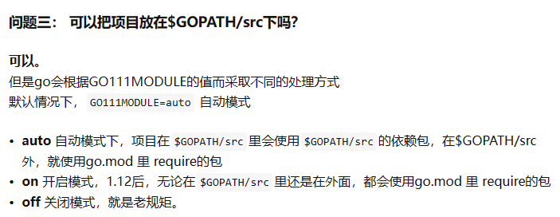

# 入门

## go程序目录结构


## 学习方向

+ 区块链、服务器/游戏服务器开发 、分布式/云计算软件工程师 

## 学习一门新技术的方法

+ 

## 代码

+ 从终端直接运行代码，必须使用特殊的包main

## 新版和旧版包管理

+ 旧版需要把项目放到GOPATH中，第三方包和自己的包的源码都在src下

+ 新版在根目录生成go.mod文件，包管理通过此文件进行管理
  + 导入的外部包会go.mod中以`require 《包名》 《版本号》`出现
  + 
  + 
  + 
  + 
  + 

+ `$GOPATH/src`外的源码包不能使用`go install`命令

  ## 包名和文件夹名

  + 一个文件夹下只能有一个包，即该文件夹下的`.go`文件的第一行代码，`package 包名`都相同
    + 一个包下的`.go`文件的组织方式无所谓，可以把代码都写在一个文件下，也可以拆分成多个文件，它们都是同一个包的一部分
  + 如果有子目录，那么子目录和父目录是完全两个不同的包
  + 一个package的文件不能在多个文件夹下，如果多个文件夹下有重名package，它们是彼此无关的两个包
  + 用go run 运行的时候只能识别main作为包运行入口，package main表示一个可独立执行的程序，其他的package是不可以独立运行的
    + 每个 Go 应用程序都包含一个名为 main 的包，且里面有一个main函数作为应用程序入口
    + 可以直接运行的`.go`文件的package名必须为main且必须有main函数
  + **如何理解文件夹名和包名不一定相同**
    + 
    + 代码中`import`的是包的导入路径、使用的是包名
    + Go语言不要求包名与导入路径有任何关系，但是按照惯例，导入路径的最后一段用作包名 => 包名应与其所在文件夹名相同
    + 因此：包名应该与保存它的目录名相匹配，但是main包是一个例外

# 基础语法

+ **变量和包**：定义和导入后就必须使用，不用就会被视为bug报错
+ **变量、函数、类型、常量的命名规则**：字母开头、任意长度、开头首字母大写表示可以在其他包中调用、开头首字母小写表示只能在当前包中使用
+ **Go的方法**：与给定类型的值相关联的函数（Go方法有点类似其他语言中附加到“对象”上的方法）
+ **变量的作用域**：由其定义的位置所在块和嵌套在该块中的任何块组成；通常用`{}`包围
  + `if`条件语句也是一个块，所以在`if`中定义的变量在`if`外不能使用
  + `if-else`分别表示两个块
  + `for`循环中的初始化语句和条件语句以及循环块都被认为在一个循环块的作用域中，因此初始化语句中声明的变量，可以在另一个循环语句中再次被声明
+ **短变量声明中**：只要有一个变量是新的，那么已经存在的变量名会被视为赋值操作
+ **函数调用**：
  + 调用当前包中定义的函数，不应该指定包名，否则会导致编译错误
+ **函数体结构**：
  + 参数必须声明类型
  + 有返回值必须声明返回值类型、有返回值类型必须有返回值、返回值类型和返回值必须匹配且一一对应
  + **返回值的声明**：可以同时声明多个返回值，用小括号括起来；声明时可以类似参数声明，为每一个返回值命名；返回值命名主要是为了方便程序员阅读，但是也属于函数块，可以不用，用的话也不需要再在函数中声明，直接赋值即可；
  + 有返回值的函数最后一行必须是`return`语句，否则会导致编译错误
+ **指针**：指向某变量的地址的值

# 常用方法

+ **错误值**
  + `err := errors.New("")`返回一个新的错误值`err`，调用`err.Error()`返回该值的错误信息
  + `err := fmt.Errorf("", value)`可以返回一个格式化的错误值
+ **包**：部分代码在多个程序之间共享

# 注释

+ **阅读包文档**：`go doc <包名> <函数名>`
+ **为包和函数添加注释**：直接在`package`和函数声明之前添加`//`注释

# 数组

+ 长度固定不可改变、存储类型一致、自动初始化为各类型的零值

+ **定义**`var myArray [3]string`

  + 字面量：`var myArray [3]string = [3]string{"1", "2"}`

  + 短变量声明/字面量：`myArray := [3]string{"1"}`，大括号可以为空，没有初值赋给相应位置

+ 调用：`myArray[0/1/2]`

+ 最常用的遍历方法：

  + ```go
    for index, value := range myArray {
        // code
    }
    ```

# 切片

+ Go的一个数据结构，可以增加更多的值，很像Python中的切片
+ **定义**`var myArray []string`
  + 声明切片变量并不会创建一个切片，还需要调用内置的make函数进行创建：`myArray = make([]sting, <初始化长度>)`
  + 短变量声明：`myArray := make([]int, <初始化长度>)`
  + 字面量：`var myArray []string = []string{"1", "2", "3"}`
  + 短变量声明/字面量：`myArray := []string{"1", "2"}`，大括号可以为空，创建一个空切片
+ 调用：`myArray[0/1/2]`
+ **性质**
  + 切片并不会自己保存任何数据，它仅仅是底层数组的元素的试图
  + 一个底层数组可以对应多个切片，这些切片可以重叠
  + 对一个底层数组修改或对任何一个切片的修改都会传播到底层数组和其他切片
  + 因此使用make或切片字面量来创建切片，而不是创建一个数组，再用一个切片在上面操作，这样就不用关心底层数组了

+ **append函数**
  + `slice = append(slice, <new_item>, ....)`在切片末尾添加元素
  + 需要确保传入的切片和返回的切片应该是一样的
    + 底层数组是不能增长的，如果数组没有足够的空间保存新元素，所有元素将会被拷贝到一个更大的数组，而且切片会被更新为引用这个新的数组
    + 因此如果传入和返回的切片不一样，就无法知道两个切片是否具有相同的底层数组，这会导致切片中的一些不一致行为

+ 切片变量有零值nil，但是可以像对待空切片一样对待nil切片


# 可变长参数函数

+ **声明时**在最后一个参数之前增加省略号：这个参数可以以切片的形式接受一组参数

  + ```go
    func myFunc(param1 int, param2 ...string) {
        //code
    }
    ```

+ **调用时**可以传递同一个类型的任意数量的值，或者传递一个切片，但传递切片时要在切片后加省略号

  + ```go
    myFunc(number, mySlice...)
    ```

# 映射

+ 一个映射是通过键来访问每一个值的集合

+ 值相同类型、键相同类型、键和值不必相同

+ **定义**：声明一个映射变量：`var myMap map[<键类型>]<值类型>`

  + 真正创建一个映射：`myMap = make(map[<键类型>]<值类型>)`
  + 短变量声明：`myMap := make(map[<键类型>]<值类型>)`
  + 字面量：`var myMap map[string]float64 = map[string]float64{"a": 1.2, "b": 5.6}`
  + 短变量声明/字面量：`myMap := map[string]float64{"a": 1.2, "b": 5.6}`，大括号可以为空，创建一个空映射

+ 几乎可以使用任意类型作为映射的键，只要这个类型可以使用==来比较

+ 访问没有赋值过的键，会得到值类型对应的零值

+ 映射变量有零值nil，当只声明没有创建的时候，它就为nil，因此不能用来赋值

+ 访问键是可选的获取第二个bool类型返回值，true表示赋过值，false表示没赋过，这是为了区分开初始化得到的零值和主动赋的零值

+ **删除**`delete(映射, 键)`

+ **遍历**

  + ```go
    for key, value := range myMap {
        //遍历键和值
    }
    for key := range myMap {
        //遍历键
    }
    for _, value := range myMap {
        //遍历值
    }
    ```


# 结构体

+ **定义**

  + ```go
    // 结构体变量定义
    var myStruct struct {
    	field1 string
    	field2 int
    }
    // 类型定义：允许创建一个新类型，每一个类型基于一个定义值如何存储的基础类型，可以使用任何类型作为基础类型，struct最常用
    type myType struct {
        // fields here
    }
    ```

+ 定义的类型和变量一样，有作用域，因此通常定义在包级别

+ 定义的类型和基本类型（struct也是基本类型的一种）一样，可以用作函数参数和返回值类型

+ 点运算符允许通过struct的指针直接访问字段

  + ```go
    func main() {
        var value myStruct
        value.myField = 3
        var pointer *myStruct = &value
        fmt.Println(pointer.myField) //pointer虽然是struct定义类型的指针，但是仍然可以使用点运算符直接访问字段值
        fmt.Println((*pointer).myField) //或者使用*取指针指向变量的值，但是一定要加括号，不然相当于视myField为指针并取值
        pointer.myField = 9 //也可以通过指针来给字段赋值
    }
    ```

+ 字面量：`myCar := car{name: "Corvette", topSpeed: "337"}`，忽略的字段被设置为各自类型的零值
+ **嵌入struct**：一个（外部）struct类型内还有一个（内部）struct类型，此时可以不定义内部struct类型名字，通过外部struct访问内部struct时，类型名当作字段名使用，或者直接忽略字段名（就像访问外部struct字段一样访问嵌入的内部struct字段）

# 定义方法

+ ```go
  type MyType string
  // 通常会说sayHi定义在了MyType类型上
  func (m MyType) sayHi() {
      fmt.Println("Hi, from", m)
  }
  ```

+ 一旦方法被定义在了某个类型上，它就能被该类型的任何值调用
+ `(m MyType)`定义一个接收器
  + 接收器参数的类型是与之联系的方法的类型，除此之外，与其他函数参数一样
  + 接收器参数的名称一般定义为类型名称的第一个字母的小写
  + Go使用接收器参数来代替其他语言中的`self`或者`this`，后者是隐式的，而接收器参数是显式声明的
  + 方法和类型必须定义在同一个包中

