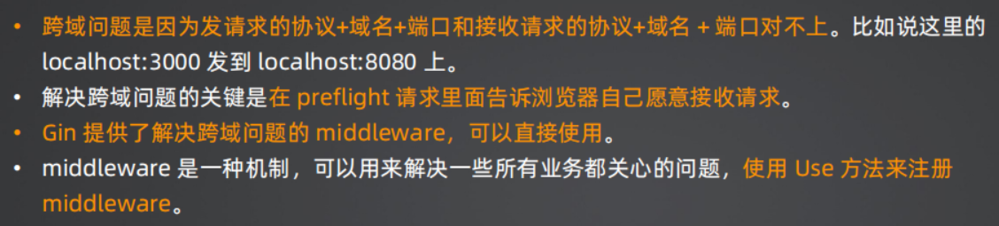
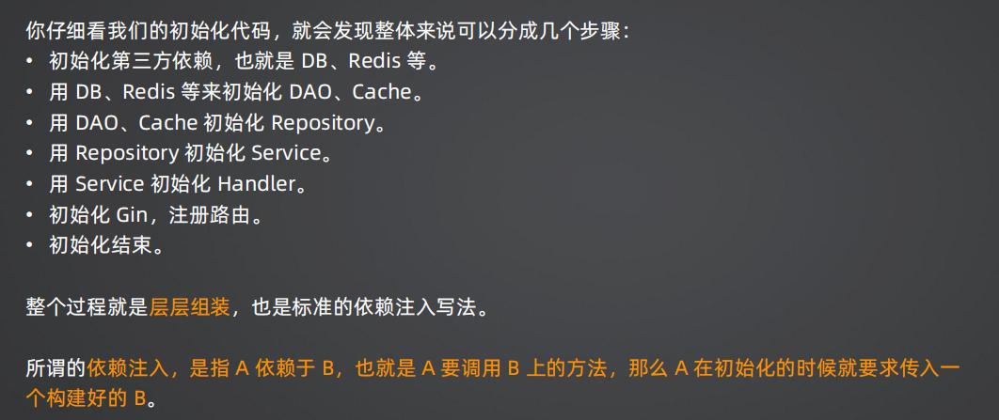
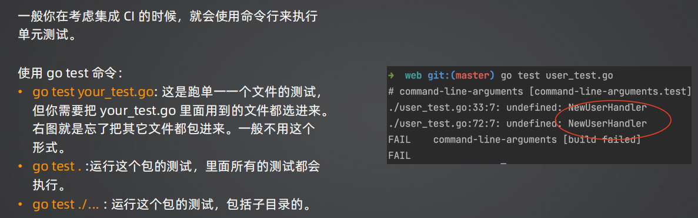
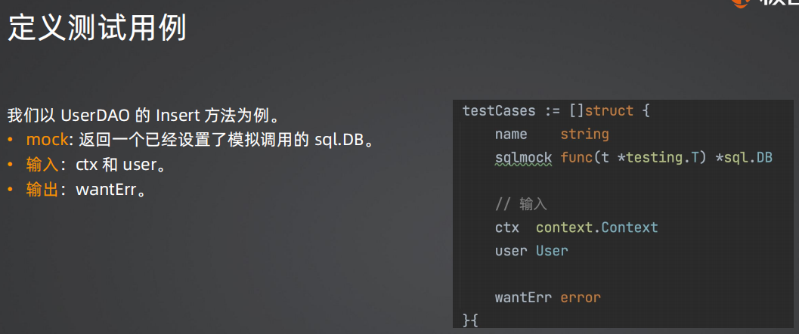
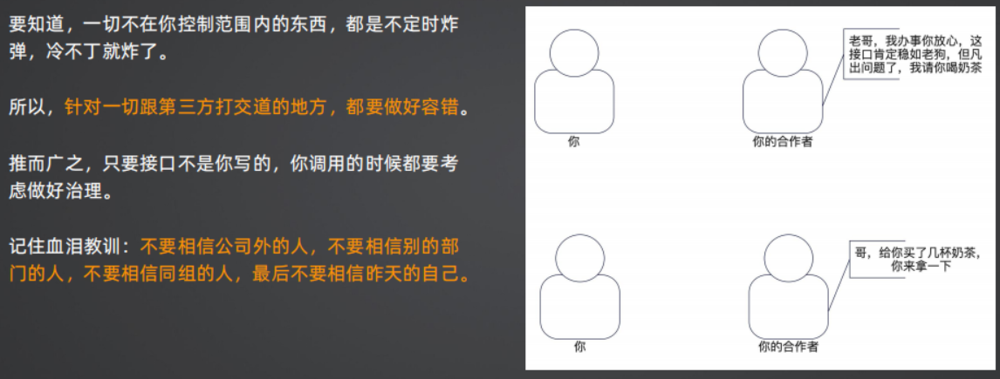

# 基础

## 函数式编程

### 入门

1. 方法本身直接赋值给某个变量，而这个变量直接就可以发起调用

+ ```GO
  func Func(a, b int) string {
  	return strconv.Itoa(a + b)
  }
  
  func main() {
  	myFunc := Func
  	str := myFunc(1, 2)
  	_ = myFunc(1, 2)
  	println(str)
  }
  ```

2. 局部方法：可以在方法内部直接声明一个局部方法，它的作用域就在本方法内

+ ```go
  func FuncLocal() {
  	fn := func(a, b int) string {
  		return strconv.Itoa(a + b)
  	}
  	println(fn(1, 2))
  }
  ```

3. 方法作为返回值

+ ```go
  func FuncReturn() func(a, b int) string {
  	return func(a, b int) string {
  		return strconv.Itoa(a + b)
  	}
  }
  
  func main() {
  	fn := FuncReturn()
  	str := fn(1, 2)
  	println(str)
  }
  ```

4. 匿名方法直接发起调用

+ ```go
  func FuncDirect() {
  	fn := func(a, b int) string {
  		return strconv.Itoa(a + b)
  	}(1, 2)
  	println(fn)
  }
  ```

### 闭包

+ **定义**：方法+它绑定的（运行）上下文

+ ```go
  func Closure(name string) func() string {
  	// return的这个方法，就叫闭包
  	// 它由方法 和 运行时的上下文（这里只有name）两部分组成
  	return func() string {
          world := "world"   // 局部变量，不属于上下文
  		return "hello, " + name + world
  	}
  }
  
  func ClosureInvoke() {
  	c := Closure("harmonic")
  	println(c())
  }
  
  func main() {
  	ClosureInvoke()
  }
  ```

+ 上下文的判定：返回的那个函数外部定义的变量才是上下文，该函数的局部变量不是上下文
+ **注意**：闭包如果使用不当可能会引起内存泄露。因为一个对象被闭包引用的话，闭包用完之前，它是不会被垃圾回收的。
+ 闭包可以捕获外部变量的引用，并在闭包内部修改它们。因此在闭包内部修改了外部变量，这个修改在闭包外部是可见的。
+ ```go
  func main() {
  	x := 10
  	func() {
  		x = 20
  	}()
  	println(x)  // 20
  }
  ```


## defer

### defer与闭包

+ 确定值原则

+ ```go
  // 作为闭包引入的：执行defer对应的方法时才确定
  func DeferClosure() {
  	i := 0
  	defer func() {
  		println(i)   // 1
  	}()
  	i = 1
  }
  
  // 作为参数引入时：定义defer得时候就确定了（因为定义的时候，参数就已经触发复制，成为该函数内的局部变量了）
  func DeferClosureV1() {
  	i := 0
  	defer func(i int) {
  		println(i)   // 0
  	}(i)
  	i = 1
  }
  ```

### defer与返回值

+ 如果想在defer里修改返回值，那么这个返回值必须要带名字，否则不能修改。

  > 第一周课件，p49

## 不要对迭代参数取地址！

+ ```go
  type User struct {
  	Name string
  }
  
  func LoopBug() {
  	users := []User{
  		{
  			Name: "Tom",
  		},
  		{
  			Name: "Jerry",
  		},
  	}
  
  	m := make(map[string]*User)
  	// 不要对迭代参数取地址！
      // 因为迭代参数的地址在内存中是同一个。
      // 遍历第一个会把第一个值放入该地址，第二个会把第二个值放入该地址...，但是该地址是不变的
  	for _, u := range users {
  		m[u.Name] = &u  
  	}
  	for k, v := range m {
  		fmt.Printf("name: %s, user: %v", k, v)  // 因此这里打印的v永远是最后一个遍历的值
  		println()
  	}
  }
  // name: Tom, user: &{Jerry}
  // name: Jerry, user: &{Jerry}
  ```

  

# Gin

+ 一个 Web 服务器被抽象成为 Engine
  + Engine 承担了路由注册、接入 middleware的核心职责。
  + 它组合了 RouterGroup，RouterGroup 才是实现路由功能的核心组件。

## gin.Context

+ 核心职责
  + 处理请求
  + 返回响应

## 路由

+ 
+ 
+ 

## 集中注册 vs 分散注册

+ 

## Bind: 接收请求数据

+ 


# DDD设计理念

+ 

# webook

## 目录结构

### v1

+ 

## 跨域请求

+ 

### preflight请求特征

+ 

### cors各个属性的含义介绍 

+ 

> 2.3：15分钟左右

## 跨域问题要点

+ 

## middleware

+ 

### 常见AOP

+ 日志、链路追踪、普罗米修斯、登录校验、鉴权。。。

### 在gin中的常见用法

+ 
+ 

## Service - Repostiory - DAO三层结构

+ 

+ 

### 调用流程

+ 

> 注意2.5中讲到的关于项目结构及其设计思想的知识
>
> + 哪怕不同层次方法的命名也很有讲究，体现了对应层次性质的理解

### 为什么domain中有User、到了dao还会重新定义一个User

+ 

## 获得邮件冲突错误（由数据库DAO层返回）

+ 
+ 其它的数据库，看看有没有暴露类似`mysql.MySQLError`的方法

### 重点：使用别名机制层层传导错误，避免跨层依赖问题

+ 

## 登录功能

### HTTP/Cookie/Session

+ 
+ 
+ 
+ 

## Gin session存储实现

+ 

## JWT校验

+ 
+ 

### 本项目约定

+ 

### 本项目接入JWT步骤

+ 

### JWT与Session的对比

+ 
+ 

## 限流

> + 手写限流算法？：`webook/pkg/ginx/middleware/ratelimit` 

### 用 Redis 做限流

+ 

## 增强登录安全性

### 通常：使用浏览器指纹

+ 浏览器指纹是一种通过收集浏览器特征信息来识别和跟踪用户的技术。这些特征信息包括浏览器类型、操作系统、屏幕分辨率、语言、插件、字体、时区等。通过对这些信息进行组合，可以生成一个唯一的浏览器指纹（hash值），从而识别和跟踪用户的行为。

### 本项目：使用 User-Agent

+ 

## k8s

### Deployment.yaml 和 Service.yaml 文档中各个字段的含义

> 第三周课件（下）P16-23

### Deployment Pod Service 三者之间的关系

+ 

> `https://chat.openai.com/share/b8bfb4ef-89fb-4d84-a5f0-72030d0e45cf` 最后两个QA

### PersistentVolume 和 PersistentVolumeClaim 的区别

+ 

### port nodeport targetport 之间的区别

+ 

## windows使用wrk压测工具

+ 
+ 在wsl中安装linux子系统，子系统中安装并使用wrk

## 使用Redis优化性能（数据库向）

### 使用序列化和反序列化

+ 

> 重要：性能优化的代码详解 4.2  20分钟左右往后
>

### Redis 存储方式简介

+ 

## 从需求和系统角度分析验证码登录的功能

+ 重点体会可扩展性的系统设计

> 第四周第二个ppt

## 依赖注入

### 什么是依赖注入

+ 

### 为什么要依赖注入

+ 

## IoC：控制反转

+ 
+ 为什么叫控制反转：
  + 强耦合情况下（UserHandler创建userService），userService控制住了UserHandler，因此控制反转就是希望UserHandler能够控制userService
  + 包括依赖发现和依赖注入，但是Go语言中不支持依赖发现，只能通过插件实现，因此更倾向于依赖注入

## 项目依赖关系

+ 

## 为什么用wire进行初始化

+ 
+ 

## 什么是面向接口编程

+ 

## 测试

### 单元测试

+ 

### 命令行

+ 

### Table Driven 模型

+ 

### 常见测试用例的定义

+ 

### Mock

+ 
+ 

### 测试流程(handler为例)

+ 

### 步骤(handler为例)

+ 

### SqlMock

+ 
+ 
+ 

### 集成测试

+ 
+ 

## 第三方服务治理

+ 

### 限流

+ 

### 自动切换不同服务商

+ 
+ 
+ 

## 装饰器模式

+ 
+ 

### 以短信服务举例

+ 

### 两种实现方法和比较

+ 

### 开闭原则、非侵入式

+ 


# 面试要点

## week1

+ 

+ defer实现机制与切片的扩容


> 第一周课件：P105-P113

## week2

+ 

### 跨域问题与解决

+ 

### 为什么使用自增主键？

+ 树单向增长，不存在页分裂
+ 适合范围查询，充分利用操作系统预读机制

> 2.6视频8：30左右

### GORM增强扩展功能（课程中写到就抽取整理出来）

+ 

## week3

+ 
+ 

## week4

### 如何在测试中维护登录态

+ 

### Redis 面试题目

+ 

### 依赖注入

+ 

## week5

### 维护一个高可用的短信服务

+ 
